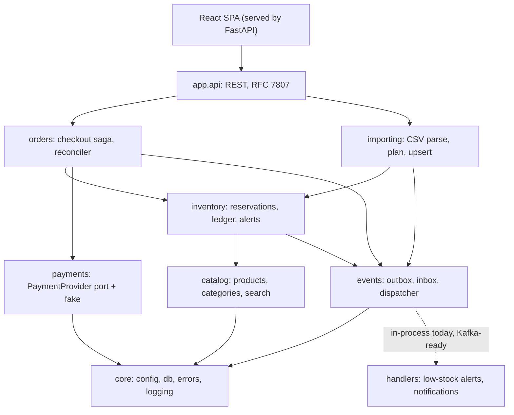

# Test Shop: an e-commerce app built for correctness under failure

[](https://github.com/devSamuel/testshop/actions/workflows/ci.yml)

Product CRUD, a CSV importer that never guesses, typo-tolerant search, and a crash-safe checkout. Everything runs from one `docker compose up`.

> **Provided example file:** [`data/products.csv`](data/products.csv), **downloaded on 2026-10-02**.
> - The app seeds from it, and **its rows define the import rules** ([row by row](#rules-derived-from-the-official-example-file)).


---

## Reviewer's guide (5 minutes)

```bash
docker compose up --build        # or: make up
open http://localhost:8080       # UI · API docs at /api/docs
```

| # | Try this | What it proves |
|---|---|---|
| 1 | **Admin → Import**: upload `data/products.csv` (the provided example file), review the dry run, then confirm | Every problem planted in the official file is caught with a reason: a `free` price, negative stock, an XSS name, empty names, conflicting duplicates. Harmless ones are warnings, and nothing is silently coerced ([rules](#rules-derived-from-the-official-example-file), [ADR 0005](docs/adr/0005-partial-success-import.md)) |
| 2 | **Shop**: search `blutooth`, then `keybaord` | Typo tolerance, with a fuzzy fallback for transposed letters ([ADR 0007](docs/adr/0007-search.md)) |
| 3 | **Checkout** with `4000 0000 0000 0002`, then with `4000 0000 0000 0101` | A decline releases stock (saga compensation). A slow provider returns `202`, and the reconciler settles it ([ADR 0003](docs/adr/0003-checkout-saga-and-outbox.md)) |
| 4 | **Admin → Products → Stock history** | Every unit is accounted for in an append-only ledger ([ADR 0006](docs/adr/0006-inventory-ledger.md)) |
| 5 | `make chaos` | The app is **SIGKILLed mid-checkout** while 50 clients retry. Nothing is oversold, duplicated, lost or left pending ([result](docs/chaos.md)) |

There is no login: the admin screens are open on purpose. [Security scope](#security-scope) says exactly what that exposes and how production would close it.

Where to look first in the code:
- [`orders/checkout.py`](backend/app/orders/checkout.py): the saga
- [`inventory/service.py`](backend/app/inventory/service.py): atomic reservation and ledger
- [`importing/parsing.py`](backend/app/importing/parsing.py): the importer's rules
- [`events/dispatcher.py`](backend/app/events/dispatcher.py): the outbox
- [`tests/integration/test_stateful.py`](backend/tests/integration/test_stateful.py): a model-based test of the whole system

---

**Contents:** [Running it](#running-it) · [What was built](#what-was-built) · [Architecture](#architecture-at-a-glance) · [The example file](#the-example-file-and-the-csv-contract) · [Questions](#questions-i-would-ask-the-product-owner) · [Decisions](#decisions-and-alternatives-considered) · [How I guided the AI](#how-i-guided-the-ai) · [Testing](#testing-and-evidence) · [Scope](#scope-built-and-recommended-but-not-built) · [Security](#security-scope) · [Documentation](#documentation)

---

## Running it

### With Docker (recommended)

**Requirements:** Docker with Compose v2.

```bash
docker compose up --build
```

- **UI:** http://localhost:8080
- **OpenAPI docs:** http://localhost:8080/api/docs
- **Health:** `/healthz` (liveness) and `/readyz` (database)

On start, the API container runs the Alembic migrations and seeds an empty catalog from the provided example file, `data/products.csv`: 87 products imported, 7 rows rejected with reasons.

`docker compose up` runs one image as two containers, plus Postgres: the API (`app`), which also serves the UI, and a `worker` that does all the background work (outbox delivery and the payment reconciler). `make up WORKERS=N` runs N workers ([why](docs/adr/0003-checkout-saga-and-outbox.md)).

**Verified** from a clean clone with the official base images on Apple Silicon (arm64). CI builds the same images on amd64.

**Port 8080 or 5432 already in use?** Set `APP_PORT=8088 DB_PORT=5433 docker compose up --build`.

**Importing a file into the running app:** use Admin → Import, or `make import FILE=data/products.csv`.

**Test cards** (any future expiry, any CVC):

| Card | Behaviour |
|---|---|
| `4242 4242 4242 4242` | Approved |
| `4000 0000 0000 0002` | Declined: the order becomes `payment_failed` and stock is released |
| `4000 0000 0000 0101` | Approved after ~6 s: the API answers `202`, and the UI polls until the reconciler marks it `paid` |

### Without Docker (development)

**Requirements:** [uv](https://docs.astral.sh/uv/), Node 22.22+ or 24+, and a Postgres 16 instance. The compose `db` service is the easiest.

```bash
docker compose up -d db                 # Postgres on :5432
make dev-api                            # migrate + API with reload on :8000
make dev-worker                         # outbox dispatchers + reconciler
make dev-web                            # Vite on :5173, proxying /api to :8000
```

<details><summary>Manual commands</summary>

```bash
cd backend
uv sync
uv run alembic upgrade head
uv run python -m app.cli import ../data/products.csv
uv run uvicorn app.main:app --reload --port 8000
uv run python -m app.worker

cd ../frontend
npm install
VITE_API_PROXY=http://localhost:8000 npm run dev
```
</details>

### Tests and quality gates

| Command | What runs |
|---|---|
| `make test` | Backend unit, property-based, integration, concurrency and stateful tests on **real Postgres**, plus frontend Vitest |
| `make test-unit` | Fast parser and domain tests (no database) |
| `make e2e` | Playwright in a real browser against the running stack: product CRUD, search, a declined then paid checkout, and the official file's import |
| `make screenshots` | Regenerates `docs/screenshots` with Playwright; run it against a fresh stack (`make reset up`) |
| `make lint` | `ruff`, `mypy --strict`, `import-linter` architecture contracts, ESLint, `tsc` |
| `make chaos` | Kill-the-container experiment against the running stack |
| `make seed-large && make bench` | 100k-product catalog, then search latency and hot-product checkout throughput → [`docs/benchmarks.md`](docs/benchmarks.md) |
| `make invariants` | Live data-integrity report (`GET /api/admin/invariants`) |

**CI** ([`.github/workflows/ci.yml`](.github/workflows/ci.yml)) runs the linters, `alembic check`, the tests on a Postgres service, `pip-audit` and `npm audit`, a Docker build with smoke tests and a non-root check, and the Playwright suite against that stack, followed by the invariants again.

---

## What was built

| Requirement | Implementation |
|---|---|
| Local DB | PostgreSQL 16 (Compose), with Alembic migrations |
| CRUD for products | REST API with optimistic locking (`version`, a stale edit returns `409`), soft delete (order history stays intact), and RFC 7807 errors. The UI includes a stale-edit dialog |
| Import from CSV | Dry run → review → confirm; per-row errors and warnings; upsert by SKU; downloadable issue report; audit trail; CLI and UI share one service |
| Search | Postgres full-text plus trigram search: prefix, typo tolerance, SKU match, filters, sorting, pagination |
| Purchase (fake payment) | Idempotent checkout saga with a `PaymentProvider` port, a fake provider with test cards, a reconciler, and compensation |
| UI for all three | React + Mantine: Shop, Cart/Checkout, Orders, Admin (Products, Stock history, Import, System health) |
| Docker | One multi-stage image (Node build → Python runtime, non-root) plus Postgres, with health checks |
| README | This document, plus [8 ADRs](docs/adr), [architecture](docs/architecture.md), [questions](docs/questions.md), [scaling](docs/scaling.md) and an [AI log](docs/ai-log.md) |

<details><summary><b>Screenshots</b></summary>

| | |
|---|---|
|  **Typo-tolerant search** |  **Fuzzy fallback for transposed letters** |
|  **Declined card: stock released, cart kept** |  **Paid order with snapshot prices** |
|  **Import dry run with per-row issues** |  **Stock ledger: reserve → release (declined) → reserve (paid)** |
|  **Live invariants and outbox health** |  **Responsive layout** |

</details>

---

## Architecture at a glance



- **A modular monolith** with layers enforced in CI by `import-linter` ([ADR 0002](docs/adr/0002-modular-monolith.md)). It's ready to split into services, but honestly not split yet: the modules still share one database ([what it would take](docs/architecture.md#6-from-modular-monolith-to-services)).
- **Checkout is an orchestrated saga:** reserve stock, charge with no transaction held, then settle or compensate. Idempotency keys make retries safe, a reconciler settles crashes, and every crash point has a test ([sequence and crash table](docs/architecture.md#checkout-orchestrated-saga-in-orderscheckoutpy), [ADR 0003](docs/adr/0003-checkout-saga-and-outbox.md)).
- **Side effects go through a transactional outbox,** delivered by a separate worker container that scales by replicas ([events](docs/architecture.md#events-where-the-outbox-is-used-and-how-it-grows)).
- **Stock is reserved with one conditional `UPDATE`,** so overselling is impossible, and every change writes an append-only ledger row. Ten invariants are checked live at `GET /api/admin/invariants` ([ADR 0004](docs/adr/0004-atomic-stock-reservation.md), [ADR 0006](docs/adr/0006-inventory-ledger.md)).
- **Imports stream end to end,** with a dry run before anything is written and a commit per batch of 500 rows ([ADR 0005](docs/adr/0005-partial-success-import.md), [upload path](docs/upload-path.md)).
- **Search** combines Postgres full-text and trigram matching, with a fuzzy fallback for transposed letters ([ADR 0007](docs/adr/0007-search.md)).
- **Money** is `NUMERIC(12,2)` and `Decimal` end to end, serialized as strings and summed in integer cents in the UI. The order line snapshots the database price.

---

## The example file and the CSV contract

### Rules derived from the official example file

The example file contains deliberate traps. Each rule below exists because of a specific row in it.

| Row | Value in the official file | Rule | Outcome |
|---|---|---|---|
| 4 | price `$29.99` | Strip the currency symbol (USD only) | ✅ imported as 29.99 |
| 7 | price `free` | Text is not a price, and it's never read as 0: money fails safe. **(new message)**: "Price is text ('free'), not a number; enter 0.00 if the product is intentionally free" | ❌ error |
| 16 | stock `-5` | Stock can't be negative | ❌ error |
| 20 | name `<script>alert('xss')</script>` | **(new)** Product text must be plain text, so HTML markup is rejected. The API enforces the same rule, and the UI renders all text escaped anyway (tested) | ❌ error |
| 25, 41 | name empty / only spaces | A name is required; whitespace is trimmed first | ❌ error |
| 29 | name `Robert'); DROP TABLE products;--` | Kept verbatim. All SQL is parameterized, and a pattern block on quotes or semicolons would also reject legitimate names. A test proves the name round-trips and the table survives | ✅ imported |
| 36 vs 2 | `RS-001` repeated with a different description, price and stock ("Updated…") | **Conflicting duplicate:** the first row is kept and later rows are errors. The "Updated" text hints at intent, but choosing a winner silently is guessing, so the dry run flags it for review | ❌ error |
| 56 vs 11 | `BS-021` "Same SKU different description and price" | Conflicting duplicate | ❌ error |
| 89 vs 11 | `BS-021` identical to row 11 | **(new)** Identical duplicate: nothing to import | ⚠️ warning, skipped |
| 47 | price `0.00` (Mystery Box) | A zero price is allowed, but flagged | ⚠️ warning |
| 50 | Gaming Keyboard with the `weight_kg` column missing | A short row is accepted, and the weight is stored as unknown **(new explicit warning)** | ⚠️ warning |
| 52 | Gift Card: empty category, stock `99999`, weight `0` | The category becomes `Uncategorized`. `99999` is **(new)** flagged as a likely placeholder for "unlimited". Weight 0 is valid for a digital product | ⚠️ warnings |
| 51 | stock `0` | Valid: out of stock | ✅ |
| 31, 49, 53, 59 | `—`/`™`, a `;` in text, a comma inside a quoted name, escaped `""` quotes | RFC 4180 parsing, UTF-8 | ✅ verbatim |
| 55, 68 | same name as another product, different SKU | Identity is the SKU, not the name | ✅ different products |
| 62–63 | blank rows | Skipped | (ignored) |

**Result:** 95 data rows → **87 products imported**, 7 rows rejected with reasons, 6 warnings, 1 identical duplicate skipped, and 2 blank rows ignored. `test_official_example_file_end_to_end` imports the real file and pins all of this.

More defensive rules, beyond the official file, are in [ADR 0005](docs/adr/0005-partial-success-import.md#addendum-rules-beyond-the-official-file): encodings and delimiters, header aliases, unit conversions, shifted columns and size limits. The same ADR covers absolute stock, flagged price swings, the audit trail and safe re-runs. How an upload travels, hop by hop: [upload path](docs/upload-path.md).

### Critique of the proposed CSV structure

The CSV structure is only *proposed*, so here is how I would push back on it:

| Proposed | Problem | Proposal (v2) |
|---|---|---|
| `stock (string/int)` | A string invites `N/A`, `in stock` and `12 units`, so the importer must guess | `stock_on_hand` as a non-negative integer; unknown means omit the row, not a sentinel string |
| `price (decimal)` | No currency, no separator rules | `price_minor` (integer cents) **or** `price` with `.` as the decimal separator, plus `currency` (ISO 4217) |
| `category (string/enum)` | Free text drifts (`Electronics`, `electronics `, `Electronic`) | A controlled list (`category_code`); unknown codes are rejected and the list is managed in the app |
| `weight_kg (decimal)` | The unit is in the header, but files arrive in g or lb | Keep kg, but document it; or `weight` + `weight_unit` |
| No identity or versioning | You can't tell an intentional update from a stale file, or detect deletions | `updated_at` per row and a file-level `export_id`; an optional `mode=full|delta` so a full export can deactivate missing SKUs |
| No encoding or quoting spec | Unquoted commas silently shift columns | RFC 4180, UTF-8, comma-delimited, mandatory quoting for text fields |

The importer stays backward compatible: v2 columns would be added as aliases, and the current rules keep working.

---

## Questions I would ask the product owner

Each question has an explicit assumption that the code centralizes, so a product owner can change any of them. These are the eight with the most impact on the design; all 25 are in [docs/questions.md](docs/questions.md).

| # | Question | Assumption made |
|---|---|---|
| 1 | Does a CSV row with an existing SKU **update** the product or get rejected? | Update (upsert by SKU); changes are shown in the dry run first |
| 2 | Is CSV `stock` an **absolute** count or a **delta**? On hand or sellable? | Absolute sellable quantity; units reserved by in-flight checkouts are subtracted |
| 3 | Should a file with some bad rows be imported **partially** or rejected entirely? | Partial, with a dry run first; all-or-nothing is a small flag if needed |
| 18 | Within one file, if a SKU repeats with **different** values (official rows 36 and 56), which row wins? | Neither silently: the first row is kept and the later ones are errors for review. Row 36's "Updated…" text hints at last-row-wins; if confirmed, that needs a pre-pass over the whole file before writing |
| 9 | When is stock reserved: in the cart or at checkout? | At checkout, for 10 minutes; carts don't hold stock |
| 15 | What happens if a payment succeeds after the reservation expired? | No silent capture: the order stays expired and `RefundRequired` is raised for finance or ops |
| 7 | What does deleting a product mean if it has orders? | Soft delete: hidden from the shop and admin lists; orders keep their snapshot; the SKU can be reused |
| 12 | Who can create, edit and import products, and who may see customer orders? | Nobody signs in to this build, by decision: the admin screens and the full orders list, customer emails included, are open. [Security scope](#security-scope) lists the exposure and the production design |

---

## Decisions and alternatives considered

| Decision | Chosen | Alternatives considered | Why |
|---|---|---|---|
| Database | **PostgreSQL 16** | SQLite, MongoDB, MySQL | Exact money, row locks, `SKIP LOCKED`, partial indexes, FTS + trigram search ([ADR 0001](docs/adr/0001-postgresql.md)) |
| Architecture | **Modular monolith** with enforced boundaries | Microservices; layer-by-technical-concern | ACID where money lives; one image and one command to run; boundaries make extraction mechanical later ([ADR 0002](docs/adr/0002-modular-monolith.md)) |
| Checkout consistency | **In-process orchestrated saga** + reconciler | One big transaction; broker-based saga; Temporal | No transaction held across the payment call; every crash point recoverable; no infrastructure without a need ([ADR 0003](docs/adr/0003-checkout-saga-and-outbox.md)) |
| Side effects | **Transactional outbox** + idempotent handlers | Fire-and-forget after commit; Kafka now | Never lost, never sent for rolled-back changes; Kafka-ready ([evolution](docs/evolution.md)) |
| Stock reservation | **Conditional `UPDATE … WHERE stock >= qty`** | `SELECT FOR UPDATE`; optimistic retry; Redis | One round trip, impossible to oversell, tiny lock window ([ADR 0004](docs/adr/0004-atomic-stock-reservation.md)) |
| Import semantics | **Partial success + dry run + never guess**, streamed and committed per batch | All-or-nothing in one transaction; load the whole file; lenient coercion | Bad data is visible, not silently "fixed"; no long locks on products being sold; memory independent of file size ([ADR 0005](docs/adr/0005-partial-success-import.md)) |
| Concurrent admin edits | **Optimistic locking** (`version`), plus an `expected_stock` precondition for stock edits | Last write wins; pessimistic locks | Prevents silent overwrites without blocking. Sales don't bump the version (no false conflicts), but a stock edit made after units were sold gets a `409` instead of erasing those sales |
| Search | **Postgres FTS + pg_trgm + fuzzy fallback** | `LIKE`; Elasticsearch or OpenSearch; semantic search with embeddings | Good relevance and typo tolerance with zero extra infrastructure. A search engine, then hybrid semantic search, are the next steps when the catalog outgrows it ([ADR 0007](docs/adr/0007-search.md), [scaling](docs/scaling.md#search-at-scale-a-search-engine-then-semantic-search)) |
| Delete | **Soft delete** + partial unique SKU index | Hard delete; `ON DELETE CASCADE` | Order history keeps its products; a SKU can be re-created |
| Authentication | **Not built for the test**; the exposure and the production design are documented | Session cookie, JWT, OAuth/OIDC single sign-on, API keys | The effort went into correctness under failure. The open surface is stated precisely, and the grouped routers keep adding auth a contained change ([ADR 0008](docs/adr/0008-security-scope.md)) |

<details><summary><b>More decisions</b>: stock history, uploads, payment timeout, stack, packaging, pagination</summary>

| Decision | Chosen | Alternatives considered | Why |
|---|---|---|---|
| Stock history | **Append-only ledger + cached balance** | Mutable column only; full event sourcing | Auditability at a fraction of event sourcing's complexity ([ADR 0006](docs/adr/0006-inventory-ledger.md)) |
| Large-file upload | **Stream through the API to disk**, apply by run id | Re-upload on confirm; presigned S3 upload | Fits the one-command Docker requirement with no cloud dependencies. The S3 path is designed in [scaling.md](docs/scaling.md#production-path-for-very-large-files-upload-straight-to-s3), and `UploadStore` is the seam for it |
| Payment timeout | **Sync fast path, `202` fallback** | Always sync; always async | Most checkouts answer immediately; slow providers don't hold connections or locks |
| Backend stack | **FastAPI, SQLAlchemy 2 async, Pydantic v2, uv** | Django, Flask | Typed request/response models, OpenAPI for free, async I/O for the payment call |
| Frontend | **React + TypeScript + Mantine + TanStack Query** | Next.js, server-rendered templates | An SPA served by the same container; the query cache handles polling and invalidation cleanly |
| Packaging | **One image, run as two app containers**: FastAPI serves the built SPA; the same image runs the `worker` | Separate nginx container; workers inside the API process | "Runnable as docker containers" with one `docker compose up`; no CORS; background CPU never competes with requests |
| Pagination | **Offset** with window count | Keyset | "Jump to page N" UX; keyset is the documented next step for deep pages |

</details>

---

## How I guided the AI

I used Claude Code as a pair programmer, with guardrails set before any code: `Decimal` money, a conditional `UPDATE` for stock, idempotency keys, no transaction held across the payment call, an outbox for side effects, an importer that never guesses, and tests on real Postgres. Nothing was accepted because it looked right. These five corrections mattered most:

1. **The import was only half streamed.** I asked whether we were really streaming from the browser to the endpoint. One call loaded the whole upload into memory, and the size limit ran only after the file had filled the disk. It now streams end to end: peak memory for 100k rows went from 252 MB to 98 MB, and 1M rows run in under 240 MB.
2. **Background workers shared a CPU core with checkout.** I asked: "if we're limited by the GIL, shouldn't the workers be an isolated container that just polls?" They moved to a worker container that scales by replicas, from 1,223 to 3,511 events/s with four containers.
3. **Scaling the worker multiplied the reconciler.** I asked whether the move had lost anything, and the AI checked the live database instead of answering from memory. Nothing was lost, but N workers meant N reconcilers asking the payment provider about the same orders. Now only one is active, through an advisory lock.
4. **The first saga plan could charge customers for released stock.** Walking through it showed that a crash right after a successful charge would expire the order and release its stock while the customer stayed charged. The reconciler now asks the provider first, and a late success raises `RefundRequired`.
5. **A 100k-row import took 143 s.** Measuring disproved two plausible guesses. The cause was Postgres reusing a query plan chosen while the table was empty, and one setting, scoped to the import, brought it down to 17 s.

Property-based and model-based tests also caught two crashes in code that looked right: a logging field that would have turned every committed import into a 500, and a decimal overflow in the weight parser. I also gave the AI the example file and required every import rule to trace back to one of its rows.

The full log of questions and corrections is in [docs/ai-log.md](docs/ai-log.md), and the phase-by-phase story is in the [build journal](docs/build-journal/README.md). The history was consolidated into one commit before publishing; the improvements made since are separate commits. As requested, **the code contains no comments**: a custom ESLint rule enforces it in the frontend, and the reasoning lives in these docs.

---

## Testing and evidence

| Layer | What | Where |
|---|---|---|
| Unit (no DB) | Table-driven price, stock and weight parsing; CSV structure (BOM, delimiters, quoting, shifted columns); state machine; Luhn | [`tests/unit`](backend/tests/unit) |
| Property-based | Hypothesis: arbitrary bytes never crash the importer; any record parses or yields structured errors; clean CSVs round-trip exactly | [`test_parsing_properties.py`](backend/tests/unit/test_parsing_properties.py) |
| Integration (real Postgres) | the **official example file end to end**, CRUD and conflicts, search ranking, import plan/apply/ledger/audit, every checkout outcome, outbox delivery, retries and dead-lettering | [`tests/integration`](backend/tests/integration) |
| Concurrency | Last unit among 10 buyers; 30 mixed buyers; 8 concurrent double-submits; opposite-order carts; import racing checkouts | [`test_concurrency.py`](backend/tests/integration/test_concurrency.py) |
| **Model-based** | A Hypothesis `RuleBasedStateMachine` interleaves product creation, imports, checkouts (approve/decline), crashes after reserve, crashes after charge, the passage of time plus the reconciler, and event delivery, checking **every invariant after every step** | [`test_stateful.py`](backend/tests/integration/test_stateful.py) |
| Chaos | 50 buyers, 5 units, the container SIGKILLed mid-checkout; clients retry with their keys; the books must balance | [`scripts/chaos.py`](scripts/chaos.py) |
| Performance | 100k products: search p50/p95, `EXPLAIN`, hot-product checkout throughput. A local benchmark; load tests at scale would use [k6](docs/scaling.md#load-and-burst-testing-with-k6) | [`scripts/bench.py`](scripts/bench.py) → [`docs/benchmarks.md`](docs/benchmarks.md) |
| Frontend | Money in cents, cart reducer (including clamping to the available quantity after a `409`), idempotency-key lifecycle, problem+json parsing, components | [`frontend/src`](frontend/src) (Vitest) |
| End to end | The three UI requirements in a real browser against the Docker stack: create, edit and delete a product; typo, fuzzy and SKU search; a declined then paid checkout; the official file's dry run and import | [`frontend/e2e`](frontend/e2e) (Playwright) |

**Evidence, not claims:**

| | Result |
|---|---|
| Test suites | 185 backend tests (real Postgres, ~25 s), 157 frontend tests, and 6 end-to-end browser tests (~11 s) |
| Chaos | App SIGKILLed mid-race, 50/50 clients retried with their keys: **PASS**, 0 oversold, 0 duplicates, 0 stuck, 10/10 invariants ([docs/chaos.md](docs/chaos.md)) |
| Hot product | 200 buyers on **one** row reach **85%** of the throughput of 200 buyers on 200 different rows, so the lock window is not the bottleneck ([docs/benchmarks.md](docs/benchmarks.md)) |
| Search (100k products) | Exact SKU ~5 ms; filters ~5 ms; typo ~60 ms; broad multi-thousand-match ranking 60–200 ms. `EXPLAIN` shows a `BitmapOr` over the three indexes |
| Import | 100k rows in ~17 s (identical re-run ~10 s). **1M rows** (122 MB) dry run ~15 s and apply ~3 min. Peak process memory 252 MB → **98 MB** for the same 100k file after switching to streaming |
| Official file | 95 rows → 87 imported, 7 rejected with reasons, 6 warnings, 1 identical duplicate skipped, 2 blank rows ignored, pinned by an end-to-end test |

---

## Scope: built, and recommended but not built

**Core, what was asked for:** product CRUD, CSV import, search, a purchase with a fake payment, a UI for all three, Docker, and this README.

**Hardening, chosen because the brief says enterprise-grade and money is involved:** an idempotent checkout saga with a reconciler, a transactional outbox delivered by a separate worker container, an append-only stock ledger with live invariants, a streaming importer, and property-based, model-based, chaos and end-to-end tests. Each one answers a specific failure mode, listed under [Decisions](#decisions-and-alternatives-considered).

**Recommended, not built.** Writing these down instead of building them is deliberate: building infrastructure before there's a need for it trades simplicity for nothing. The designs are in [docs/scaling.md](docs/scaling.md).

| Improvement | Worth doing when… | Already in place |
|---|---|---|
| [The whole shop at scale on AWS](docs/scaling.md#running-the-whole-shop-at-scale): rate limiting, a Redis cache and inventory gate, SQS with dead-letter queues, retries with backoff; API Gateway, ECS on Fargate, Lambda, RDS or DynamoDB | traffic outgrows one database and a few containers, flash sales hit a few products, or public APIs need rate limits | idempotency keys, the conditional stock update, the outbox with retries and dead-lettering, the `202` path |
| [Search at scale](docs/scaling.md#search-at-scale-a-search-engine-then-semantic-search): Elasticsearch or OpenSearch, then hybrid semantic search with pgvector or OpenSearch k-NN | millions of products, several languages, merchandising rules, or many zero-result searches for descriptive queries | one search entry point to put behind a port, outbox events on every product and stock change, benchmarks with `EXPLAIN` |
| [Load and burst testing with k6](docs/scaling.md#load-and-burst-testing-with-k6) | capacity planning, a launch or a flash sale, or performance checks in CI | the local benchmark scripts as a baseline, `GET /api/admin/invariants` as the correctness check after a run, `make seed-large` for production-sized data |
| [Presigned uploads straight to S3](docs/scaling.md#production-path-for-very-large-files-upload-straight-to-s3) | files exceed ~200 MB, clients have slow connections, or API bandwidth matters | the `UploadStore` port, streaming parser, apply-by-run-id |
| [Parallel chunked imports on AWS](docs/scaling.md#scaling-to-gigabyte-files-and-many-concurrent-users-parallel-chunked-imports) (S3 + Step Functions + Lambda + Fargate) | gigabyte files, or many tenants importing at once; sequential imports take hours | the pure row parser, the `import_issues` table, per-batch atomic commits, dry run → confirm |
| [One disk write per upload instead of two](docs/scaling.md#upload-path-one-disk-write-instead-of-two) | uploads through the API routinely reach gigabytes | three size guards, the chunked store with a SHA-256 |
| [Checkout scaling ladder](docs/scaling.md#checkout-at-scale) | hot-product p95, or database connections near their limits | short lock window (85% hot-row efficiency), multi-replica safety |
| [Kafka or another message broker](docs/scaling.md#event-streaming-with-a-message-broker-option-b) | other systems consume our events, or several consumers need replay and fan-out | transactional outbox, transport-agnostic idempotent handlers, a separate worker container that becomes the relay |
| [Outbox at scale](docs/scaling.md#outbox-at-scale) | millions of events a day, sub-second side effects, or a handler that needs strict ordering | a partial pending index, `oldest_pending_seconds`, dead-letter retry, convergent handlers |
| [Authentication and roles](#security-scope) | any deployment beyond a local demo | grouped admin and import routers, every admin page under `/admin` |
| [Real payments, observability, search, deploys](docs/scaling.md#product-and-platform-next-steps) | before any real production deployment | the `PaymentProvider` port, correlation ids, the invariants endpoint |

---

## Security scope

**Authentication and authorization are deliberately not built.** They weren't asked for, so the effort went into correctness under failure instead. This is exactly what that leaves open:
- every endpoint and every page is public, including admin product CRUD, imports and the System page;
- the Orders page and `GET /api/orders` list every order with the customer's email, card brand and last 4 digits, and order ids are sequential, so they can be enumerated;
- the notification log on the System page shows recipient emails.

**How production would close it:** single sign-on for staff through OIDC / OAuth 2.0, with server-side cookie sessions for the SPA and short-lived JWTs only for service clients; roles enforced on the server by one dependency on the already grouped admin and import routers; unguessable order references for customers; an audit actor on every stock change; and rate limits, CSRF checks and security headers. The full design and the alternatives are in [ADR 0008](docs/adr/0008-security-scope.md).

**Protected today:**
- parameterized SQL everywhere, Pydantic validation with explicit limits, and `CHECK` constraints as a last line of defense;
- HTML markup rejected in product text and all text rendered escaped, tested with the official file's XSS row; SQL-looking text kept verbatim, because parameterized SQL is the defense;
- CSV-injection escaping (`= + - @`) in the downloadable issue report;
- card numbers never stored or logged, only the brand and last 4 digits;
- a non-root container, a multi-stage build, and dependency audits in CI;
- RFC 7807 error bodies that never leak stack traces, with correlation ids linking a user-visible error to the server logs.

---

## Documentation

- [Architecture and patterns](docs/architecture.md): structure, the checkout sequence and its crash points, events, the data model, and 30 patterns with where and why
- [Questions and assumptions](docs/questions.md): all 25
- [Scaling and improvements](docs/scaling.md): recommended, not built: the whole shop on AWS (rate limiting, Redis, SQS with dead-letter queues, RDS or DynamoDB), Elasticsearch or OpenSearch and semantic search, load testing with k6, S3 uploads, parallel imports, Kafka, the outbox at scale
- [ADRs](docs/adr): one decision per file, including the [security scope](docs/adr/0008-security-scope.md)
- [Upload path](docs/upload-path.md): how an upload travels, hop by hop, and the streaming rewrite
- [Evolution](docs/evolution.md): from monolith to services, and the checkout scaling ladder
- [The plan and what happened to it](docs/plan.md) · [Build journal](docs/build-journal/README.md) · [AI log](docs/ai-log.md)
- Evidence: [chaos run](docs/chaos.md) · [benchmarks](docs/benchmarks.md)
