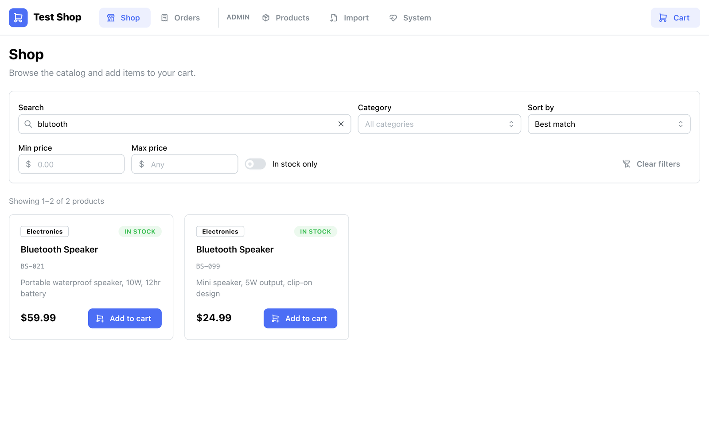
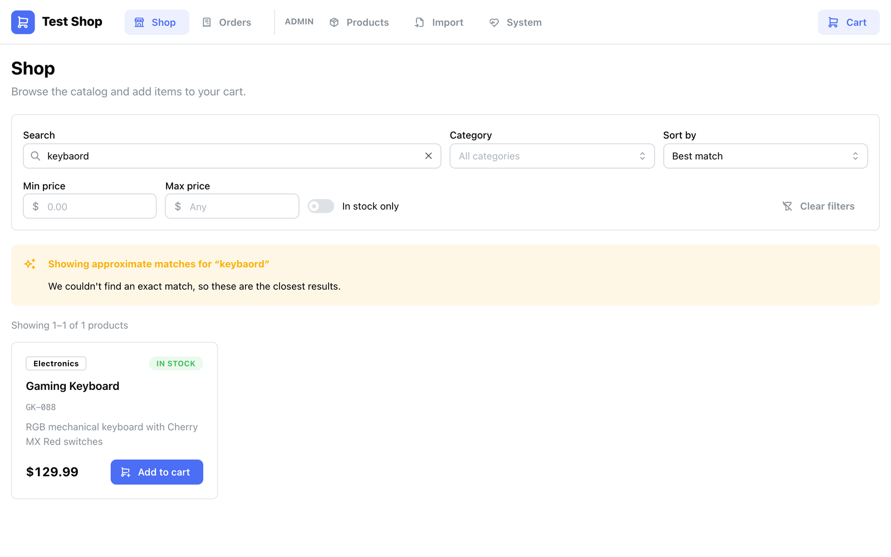
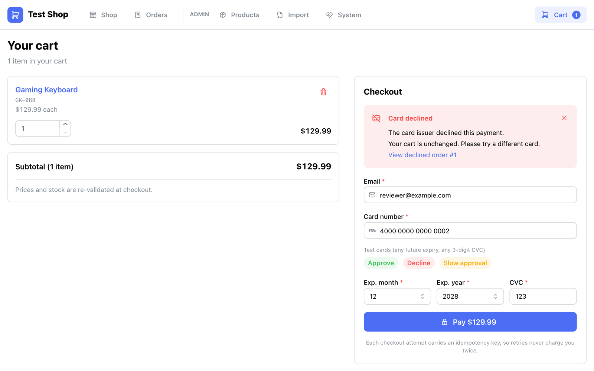
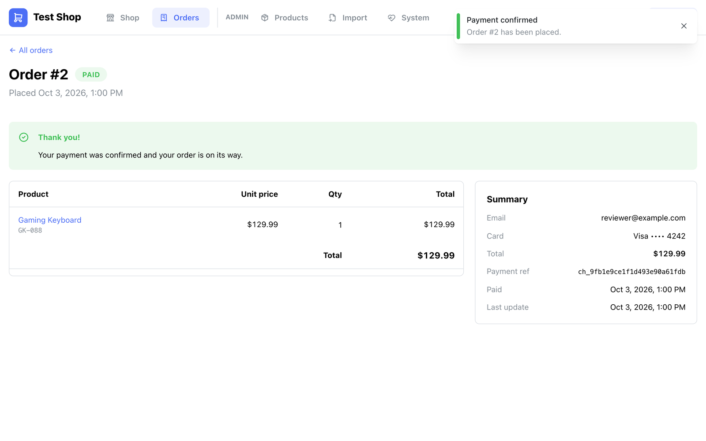
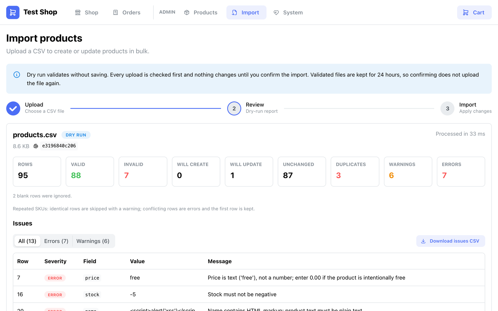
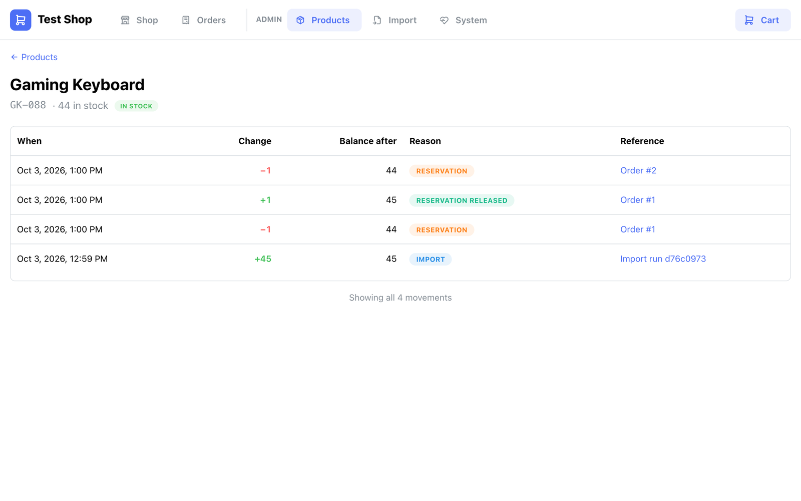
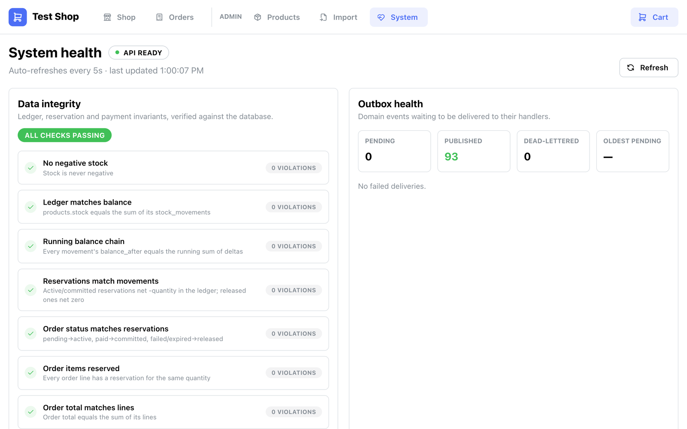
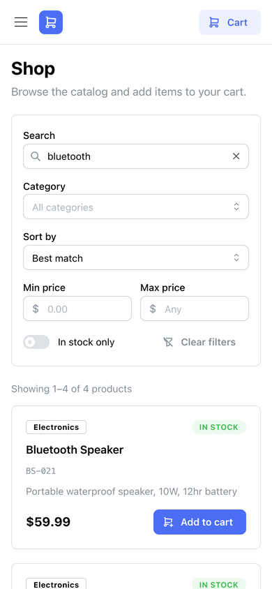

# Test Shop: an e-commerce app built for correctness under failure

[](https://github.com/devSamuel/testshop/actions/workflows/ci.yml)

Product CRUD, a CSV importer that never guesses, typo-tolerant search, and a crash-safe checkout with a fake payment provider. Everything runs from one `docker compose up`.

> **Provided example file:** [`data/products.csv`](data/products.csv), **downloaded on 2026-10-02**. The app seeds from it, and its rows define the import rules ([row by row](#rules-derived-from-the-example-file)).


---

## Reviewer's guide (5 minutes)

```bash
docker compose up --build        # or: make up
open http://localhost:8080       # UI · API docs at /api/docs
```

| # | Try this | What it shows |
|---|---|---|
| 1 | **Admin → Import**: upload `data/products.csv`, review the dry run, then confirm | Every problem planted in the file is caught with a reason, and nothing is silently coerced |
| 2 | **Shop**: search `blutooth`, then `keybaord` | Typo tolerance, with a fuzzy fallback for transposed letters |
| 3 | **Checkout** with `4000 0000 0000 0002`, then `4000 0000 0000 0101` | A decline releases stock; a slow provider returns `202` and is settled in the background |
| 4 | **Admin → Products → Stock history** | Every unit is accounted for in an append-only ledger |
| 5 | `make chaos` | The app is killed mid-checkout while 50 clients retry; nothing is oversold, duplicated or lost ([result](docs/chaos.md)) |

There is no login: admin screens are open on purpose ([security scope](#security-scope)).

Where to look first in the code: [`orders/checkout.py`](backend/app/orders/checkout.py) (the saga), [`inventory/service.py`](backend/app/inventory/service.py) (reservation and ledger), [`importing/parsing.py`](backend/app/importing/parsing.py) (import rules), [`tests/integration/test_stateful.py`](backend/tests/integration/test_stateful.py) (a model-based test of the whole system).

---

## Running it

### With Docker (recommended)
Requires Docker with Compose v2.

```bash
docker compose up --build
```

- **UI:** http://localhost:8080 · **API docs:** http://localhost:8080/api/docs · **Health:** `/healthz`, `/readyz`
- On start, the API runs migrations and seeds an empty catalog from `data/products.csv` (87 products imported, 7 rows rejected with reasons).
- Compose runs one image as two containers plus Postgres: the API (which also serves the UI) and a `worker` for background work.
- Ports in use? `APP_PORT=8088 DB_PORT=5433 docker compose up --build`.

**Test cards** (any future expiry, any CVC):

| Card | Behavior |
|---|---|
| `4242 4242 4242 4242` | Approved |
| `4000 0000 0000 0002` | Declined: the order becomes `payment_failed` and stock is released |
| `4000 0000 0000 0101` | Approved after ~6 s: the API returns `202` and the UI polls until it's `paid` |

### Without Docker (development)
Requires [uv](https://docs.astral.sh/uv/), Node 22.22+ and Postgres 16 (the compose `db` service is easiest).

```bash
docker compose up -d db     # Postgres on :5432
make dev-api                # migrate + API with reload on :8000
make dev-worker             # background worker
make dev-web                # Vite on :5173, proxying /api to :8000
```

### Tests and checks

| Command | What runs |
|---|---|
| `make test` | Backend unit, property-based, integration, concurrency and stateful tests on real Postgres, plus frontend Vitest |
| `make e2e` | Playwright against the running stack: product CRUD, search, a declined then paid checkout, the example file's import |
| `make lint` | `ruff`, `mypy --strict`, `import-linter` architecture contracts, ESLint, `tsc` |
| `make chaos` / `make bench` | Kill-the-container experiment; search and checkout benchmarks ([results](docs/benchmarks.md)) |

CI runs the linters, migration drift check, all tests, dependency audits, a Docker build with smoke tests, and the Playwright suite.

---

## What was built

| Requirement | Implementation |
|---|---|
| Local DB | PostgreSQL 16 with Alembic migrations |
| CRUD for products | REST API with optimistic locking (a stale edit returns `409`), soft delete so order history stays intact, RFC 7807 errors |
| Import from CSV | Dry run → review → confirm; per-row errors and warnings; upsert by SKU; downloadable issue report; audit trail |
| Search | Postgres full-text plus trigram: prefix, typo tolerance, SKU match, filters, sorting, pagination |
| Purchase (fake payment) | Idempotent checkout saga with a `PaymentProvider` port, a fake provider with test cards, and a reconciler |
| UI | React + Mantine: Shop, Cart/Checkout, Orders, Admin (Products, Stock history, Import, System health) |
| Docker | One multi-stage, non-root image plus Postgres, with health checks |

<details><summary><b>Screenshots</b></summary>

| | |
|---|---|
|  **Typo-tolerant search** |  **Fuzzy fallback** |
|  **Declined card: stock released** |  **Paid order** |
|  **Import dry run** |  **Stock ledger** |
|  **Live invariants** |  **Responsive layout** |

</details>

**Architecture in four lines** ([details](docs/architecture.md)):
- A modular monolith; layer boundaries are enforced in CI by `import-linter`.
- Checkout reserves stock, charges with no transaction open, then settles or compensates; idempotency keys make retries safe, and a reconciler recovers every crash point.
- Stock is reserved with one conditional `UPDATE`, so overselling is impossible, and every change writes an append-only ledger row.
- Side effects (notifications, low-stock alerts) go through a transactional outbox delivered by the worker container.

---

## The example file and the CSV contract

### Rules derived from the example file

| Row | Value | Rule | Outcome |
|---|---|---|---|
| 4 | price `$29.99` | Strip the currency symbol (USD only) | ✅ 29.99 |
| 7 | price `free` | Text is never read as 0: "enter 0.00 if the product is intentionally free" | ❌ error |
| 16 | stock `-5` | Stock can't be negative | ❌ error |
| 20 | name `<script>alert('xss')</script>` | Product text is plain text; HTML is rejected (also by the API) and the UI escapes everything | ❌ error |
| 25, 41 | empty / whitespace name | A name is required; whitespace is trimmed first | ❌ error |
| 29 | name `Robert'); DROP TABLE products;--` | Kept verbatim: parameterized SQL is the defense, and blocking quotes would reject real names | ✅ |
| 36 vs 2, 56 vs 11 | same SKU, different values | Conflicting duplicate: the first row is kept, later rows are errors for review | ❌ error |
| 89 vs 11 | `BS-021` identical to row 11 | Nothing to import | ⚠️ skipped |
| 47 | price `0.00` | Allowed, but flagged | ⚠️ warning |
| 50 | `weight_kg` column missing | Accepted; weight stored as unknown | ⚠️ warning |
| 52 | empty category, stock `99999`, weight `0` | `Uncategorized`; `99999` flagged as a likely "unlimited" placeholder; weight 0 is valid for digital goods | ⚠️ warnings |
| 31, 49, 53, 59 | `—`/`™`, `;`, quoted comma, escaped `""` | RFC 4180 parsing, UTF-8 | ✅ verbatim |
| 55, 68 | same name, different SKU | Identity is the SKU, not the name | ✅ |
| 62–63 | blank rows | Skipped | — |

**Result:** 95 data rows → **87 imported**, 7 rejected with reasons, 6 warnings, 1 identical duplicate skipped. `test_official_example_file_end_to_end` pins this. Normalization rules beyond the file (encodings, delimiters, units, shifted columns, size limits) are in [ADR 0005](docs/adr/0005-partial-success-import.md).

### Critique of the proposed CSV structure

| Proposed | Problem | Proposal |
|---|---|---|
| `stock (string/int)` | A string invites `N/A` and `12 units` | Non-negative integer; unknown means omit the row |
| `price (decimal)` | No currency or separator rules | `price` with `.` as separator plus an ISO 4217 `currency` |
| `category (string/enum)` | Free text drifts (`Electronics`, `electronics `) | A controlled list of category codes |
| No identity or versioning | Can't tell an update from a stale file, or detect deletions | `updated_at` per row and an optional full/delta mode |

---

## Questions I would ask the product owner

Each has an explicit assumption the code centralizes. These eight matter most; all 25 are in [docs/questions.md](docs/questions.md).

| # | Question | Assumption made |
|---|---|---|
| 1 | Does a CSV row with an existing SKU update the product or get rejected? | Update (upsert by SKU), shown in the dry run first |
| 2 | Is CSV `stock` absolute or a delta? | Absolute sellable quantity; units in in-flight checkouts are subtracted |
| 3 | Import partially, or reject a file with bad rows? | Partial, after a dry run |
| 18 | If a SKU repeats with different values in one file, which row wins? | Neither silently: first row kept, later ones flagged |
| 9 | Is stock reserved in the cart or at checkout? | At checkout, for 10 minutes |
| 15 | What if a payment succeeds after the reservation expired? | No silent capture: `RefundRequired` is raised for ops |
| 7 | What does deleting a product with orders mean? | Soft delete; orders keep their snapshot; the SKU can be reused |
| 12 | Who can edit products and see customer orders? | Nobody signs in to this build, by decision ([security scope](#security-scope)) |

---

## Decisions and alternatives considered

| Decision | Chosen | Alternatives considered | Why |
|---|---|---|---|
| Database | **PostgreSQL 16** | SQLite, MongoDB, MySQL | Exact money, row locks, `SKIP LOCKED`, full-text + trigram search ([ADR 0001](docs/adr/0001-postgresql.md)) |
| Architecture | **Modular monolith** | Microservices | ACID where money lives; one command to run ([ADR 0002](docs/adr/0002-modular-monolith.md)) |
| Checkout | **In-process saga + reconciler** | One big transaction; broker-based saga | No transaction held across the payment call; every crash point recoverable ([ADR 0003](docs/adr/0003-checkout-saga-and-outbox.md)) |
| Side effects | **Transactional outbox** | Fire-and-forget after commit; Kafka now | Never lost, never sent for rolled-back changes |
| Stock | **Conditional `UPDATE` + append-only ledger** | `SELECT FOR UPDATE`; Redis; event sourcing | One round trip, impossible to oversell, full audit ([ADR 0004](docs/adr/0004-stock-reservation-and-ledger.md)) |
| Import | **Partial success + dry run + never guess**, streamed, committed per batch | All-or-nothing; lenient coercion | Bad data is visible; checkouts aren't blocked; memory independent of file size ([ADR 0005](docs/adr/0005-partial-success-import.md)) |
| Admin edits | **Optimistic locking** + `expected_stock` precondition | Last write wins | No silent overwrites, and a stock edit can't erase sales |
| Search | **Postgres FTS + pg_trgm + fuzzy fallback** | `LIKE`; Elasticsearch | Typo tolerance with no extra infrastructure ([ADR 0006](docs/adr/0006-search.md)) |
| Delete | **Soft delete** + partial unique SKU index | Hard delete | Order history keeps its products |
| Authentication | **Not built**, exposure documented | Sessions, OIDC, API keys | Effort went into correctness under failure ([ADR 0007](docs/adr/0007-security-scope.md)) |
| Stack | **FastAPI, SQLAlchemy 2 async, React + TanStack Query, Mantine** | Django; Next.js | Typed models, OpenAPI for free; SPA served by the same container |

---

## How I guided the AI

I used Claude Code with guardrails set before any code: `Decimal` money, a conditional `UPDATE` for stock, idempotency keys, no transaction across the payment call, an outbox for side effects, an importer that never guesses, and tests on real Postgres. I gave it the example file and required every import rule to trace to one of its rows. The corrections that mattered most:

1. **The import was only half streamed.** I asked whether we were really streaming; the upload was read into memory. It now streams end to end (252 → 98 MB peak for 100k rows).
2. **Background work shared a CPU core with checkout.** It moved to a separate worker container that scales by replicas.
3. **Scaling the worker multiplied the reconciler.** Now only one is active, through an advisory lock.
4. **The first saga plan could charge customers for released stock.** The reconciler now asks the provider first, and a late success raises `RefundRequired`.
5. **A 100k-row import took 143 s.** Measurement disproved two guesses; the cause was a cached query plan, and one scoped setting brought it to 17 s.

Details: [docs/ai-log.md](docs/ai-log.md). The history was consolidated into one commit before publishing. As requested, **the code contains no comments**; an ESLint rule enforces it on the frontend.

---

## Testing and evidence

| | Result |
|---|---|
| Test suites | 185 backend tests on real Postgres, 157 frontend tests, 6 browser end-to-end tests |
| Model-based test | A Hypothesis state machine interleaves imports, checkouts, crashes, reconciliation and event delivery, checking every invariant after every step |
| Chaos | App killed mid-race while 50 clients retried: 0 oversold, 0 duplicates, 0 stuck ([docs/chaos.md](docs/chaos.md)) |
| Hot product | 200 buyers on one product reach 85% of the throughput of 200 buyers on different products ([docs/benchmarks.md](docs/benchmarks.md)) |
| Example file | 95 rows → 87 imported, 7 rejected, 6 warnings, pinned by an end-to-end test |

---

## Next steps (not built)

- **Authentication and roles** before any real deployment (design in [ADR 0007](docs/adr/0007-security-scope.md)).
- **A real payment provider** behind the existing `PaymentProvider` port, with webhooks.
- **Metrics, tracing and alerting** on outbox lag and the invariants endpoint.
- **A dedicated search engine** if the catalog reaches millions of products or several languages.
- **Direct-to-storage uploads** if import files outgrow 200 MB.

---

## Security scope

**Authentication and authorization are deliberately not built.** That leaves every endpoint and page public, including admin CRUD, imports, the System page, and the orders list with customer emails and card last 4 (order ids are sequential). Production would add staff single sign-on with roles enforced on the admin routers, unguessable order references, rate limits and security headers ([ADR 0007](docs/adr/0007-security-scope.md)).

**Protected today:** parameterized SQL; validated inputs with explicit limits and `CHECK` constraints; HTML rejected in product text and all text rendered escaped; CSV-injection escaping in the issue report; card numbers never stored or logged; a non-root container; dependency audits in CI; error bodies that never leak stack traces.

---

## Documentation

- [Architecture](docs/architecture.md): structure, data model, the checkout flow and its failure table, the outbox
- [ADRs](docs/adr): one decision per file
- [Questions and assumptions](docs/questions.md): all 25
- [AI log](docs/ai-log.md) · [Chaos run](docs/chaos.md) · [Benchmarks](docs/benchmarks.md)
