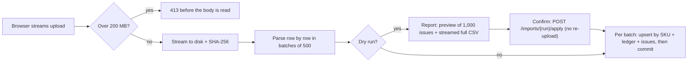

# ADR 0005: CSV import accepts valid rows, reports invalid ones, and never guesses

**Status:** Accepted

## Context
The proposed structure says `stock (string/int)`, and the example file has to be downloaded on a specific date. Both hint that real files are dirty and change over time. An importer that crashes on one bad row is useless. An importer that "fixes" bad data silently is dangerous.

## Decision
- **Partial success.** Valid rows are upserted by SKU. Invalid rows are reported with row number, field, raw value and reason. A downloadable issues CSV escapes cells against CSV injection.
- **Dry run first.** The UI validates and previews (create, update, unchanged, warnings) before anything is written.
- **Normalize what is unambiguous and warn about it:**
  - BOM, cp1252, `;`/tab delimiters, header aliases;
  - `$1,299.99`, `12 units`, `500 g` → kg, `2 lb` → kg;
  - category casing.
- **Refuse what is ambiguous or risky:**
  - `N/A` stock;
  - non-USD currency;
  - more than 2 decimals on money;
  - negative values;
  - **conflicting duplicate SKUs** (the same SKU with different values): the first row is kept, and later rows are errors that name the earlier row. **Identical** repeats are skipped with a warning, because there's nothing to decide;
  - HTML markup in product text (the official file's row 20 is an XSS payload). SQL-looking text is *kept*: parameterized SQL is the real defence, and a pattern block would reject legitimate names;
  - rows with more values than the header. An unquoted `12,99` shifts every column to the right, and importing that would silently corrupt price, stock and weight.
- **Stock is absolute.** Units reserved by in-flight checkouts are subtracted, so an import cannot resurrect stock that is being sold right now.
- Every import writes `import_runs` (audit) and `stock_movements` (ledger) rows. Price changes of ±50% or more are flagged for review.

- **Commit per batch of 500 rows, not per file.** A single file-wide transaction would hold row locks on every *updated* product until the end; checkouts of those products would hang for the whole import. Per-batch commits bound the lock time to one batch (tens of milliseconds). This is safe because:
  - the dry run has already validated every row;
  - re-running a file is **idempotent** (upsert by SKU, absolute stock values, and `IS DISTINCT FROM` skips unchanged rows);
  - an `import_runs` row is written with status `running` *before* any product changes, so every ledger entry references an existing run;
  - a mid-file failure is reported as `failed` with "the first N valid rows were applied; re-running is safe". A test injects a failure after the first batch and verifies that a re-run converges.
- **Stream end to end** (added after I asked "aren't we streaming?"; the first version read the whole upload into memory):
  - middleware rejects oversized uploads with `413` before or while reading the body;
  - the upload is streamed to disk and hashed (SHA-256);
  - a pre-pass detects the encoding and counts lines;
  - rows are parsed in batches of 500, and each batch is classified or committed as soon as it is parsed;
  - issues go to an `import_issues` table. Responses carry a 1,000-issue preview, and the full report streams from a database cursor.
  - Memory depends only on the number of distinct SKUs (the duplicate index), not on file size. The 1M-row file measured 189–240 MB peak; before this change, a 100k-row file already took 252 MB.
- **Apply by run id.** The dry run stores the file, and confirming applies exactly that stored file (same checksum) with no re-upload. A failed apply can be retried. Stored uploads expire after 24 h.
- **Duplicate semantics changed** from "last row wins" (a warning) to "first row wins, later rows are errors". Streaming can't know which row is last without reading the whole file first, and choosing a winner silently is the kind of guess this importer refuses to make. The official example file later refined this: an *identical* repeat (row 89 repeats row 11, `BS-021`) has nothing to choose between, so it is skipped with a warning. Only *conflicting* repeats are errors.
- **Profiled performance.** The lookup of existing SKUs runs with `plan_cache_mode = force_custom_plan` for the import transaction only. asyncpg prepared statements made Postgres reuse a *generic plan* chosen while the table was empty (a sequential scan) as the table grew, which made the import quadratic.

## Consequences
- The importer is fuzz-tested with Hypothesis: arbitrary bytes can produce a structured rejection, never an exception. The fuzzer found one real crash (a 26-digit weight overflowing the decimal context), which is now fixed and has a regression test.
- **Throughput:**
  - 100k rows in about 17 s fresh, 18 s when every row changes, and 10 s for an identical re-run (no writes), inside Docker on a laptop;
  - 1M rows: dry run ~15 s, apply ~3 min.
- **The upload is written to disk twice by design:** Starlette's anonymous spool file during the upload, then the durable store copy that apply-by-run-id needs. Each copy step holds about 1 MB in memory. Details in [`docs/upload-path.md`](../upload-path.md).
- Beyond 200 MB / 1M rows, [scaling.md](../scaling.md) describes the production path: presigned upload to S3, an event-driven worker using the same streaming parser, reports stored as objects, and `COPY` into a staging table for tens of millions of rows.

## Alternatives considered
- **All-or-nothing (one transaction per file):** the first implementation. Rejected after measuring: it holds locks on updated products for the whole import. The dry run gives the "review everything before writing" property without the locking cost.
- **Lenient coercion (treat `N/A` as 0, round prices):** rejected. Silent data changes are worse than a clear error.
- **Load the whole file into memory:** the first implementation. It was simple and bounded by a 20 MB limit, but peak memory was about 10× the file size, and the size limit was only checked *after* the whole upload had been written to temp disk.
- **Re-upload on confirm:** rejected once files could be hundreds of MB, and because the confirmed bytes might differ from what was reviewed.
- **Stream the request body straight into the store** (one disk write; checksum, line count and UTF-8 check computed during the upload): deferred. It would mean owning multipart edge cases Starlette already handles and describing the OpenAPI body by hand, all to save a fraction of a second per 100 MB. Presigned S3 uploads are the better step when files get that large.

## Addendum (2026-10-03): rules checked against the official file
The provided example file, `data/products.csv` (downloaded 2026-10-02), became the reference for these rules. Every planted problem was already caught: `$29.99`, `free`, `-5`, empty or whitespace-only names, conflicting duplicates, `0.00`, an empty category and blank rows.

Reading it row by row added five refinements, each traced to a row:
- an identical duplicate is now a warning instead of an error (row 89);
- HTML markup is rejected (row 20);
- a missing weight gets an explicit warning (row 50);
- a `99999` "unlimited" placeholder gets a warning (row 52);
- a text price gets a clearer message (row 7).

Result: 95 rows → 87 imported, 7 rejected, 6 warnings. The [README](../../README.md#rules-derived-from-the-official-example-file) lists every row and its rule.

## The import flow at a glance

## Addendum: rules beyond the official file

Asking for the file's download date hints that the file will change. Unit tests, the CSV fixtures in `backend/tests/fixtures` and the Hypothesis fuzz tests cover these defensive rules.

**Normalized (with a warning, so nothing changes silently):**
- UTF-8 BOM, Windows-1252 (fallback), and `;` / tab / `|` delimiters;
- header aliases (`Product Name`, `Qty`, `Weight (kg)`…);
- thousands separators and decimal commas (`$1,299.99`, `USD 15`, `12,99`, `1.299,99`);
- `12 units`, `5 pcs.`, `12.0`, and `out of stock` → 0;
- `500 g`, `2 lb` and `16 oz` → kg;
- category casing (`electronics`, `ELECTRONICS ` → `Electronics`).

**Rejected per row:**
- unknown stock (`N/A`, `unknown`, `-`);
- non-USD currencies;
- money with more than two decimals;
- invalid SKUs;
- **rows with more values than the header.** An unquoted `12,99` shifts every column to the right, which would turn price 12.99 into **price 12, stock 99, weight 200 kg**.

**Rejected as a file:**
- missing required columns;
- an empty file;
- more than 1,000,000 data rows, or larger than 200 MB (`413`). Both limits are configurable.
