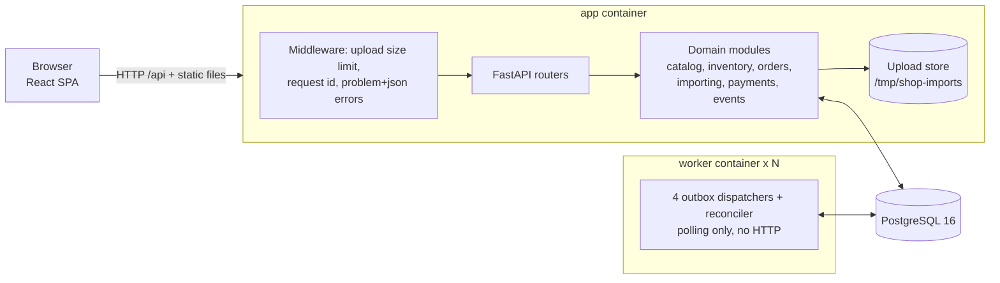
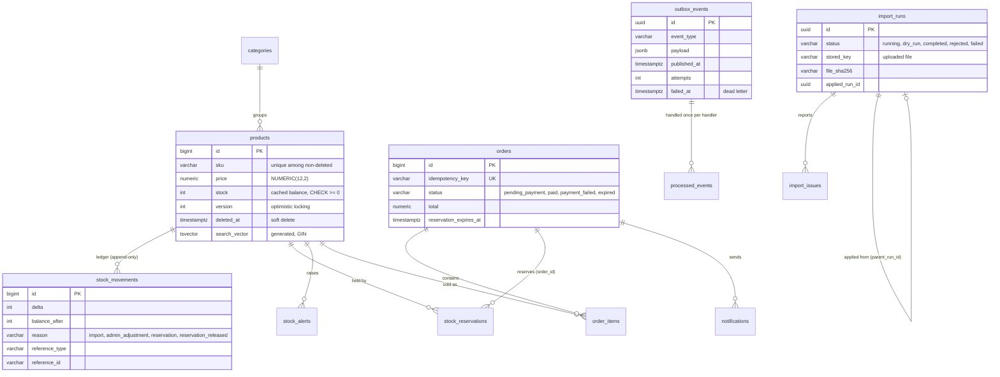
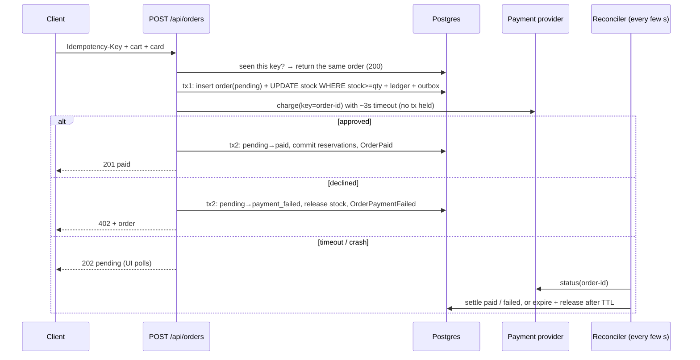

# Architecture and patterns

This document covers how the system is structured as built, what each piece is responsible for, how requests flow through it, and **which design patterns it uses, where, and why**. For the reasoning behind individual decisions, see the [ADRs](adr). For how the plan evolved during the build, see [`plan.md`](plan.md).

---

## 1. System at a glance



- **One image, one command.** The `app` container serves the API and the built SPA (which avoids CORS) and nothing else; `db` runs Postgres. `docker compose up` starts everything, matching the requirement that it be "runnable as a docker container".
- **The background workers run only in their own `worker` container.** It only polls Postgres. Why:
  - its 4 dispatcher tasks share one event loop, so they can use one CPU core at most;
  - inside the API process, they would compete with HTTP requests for that core;
  - each extra container adds a core (`make up WORKERS=N`; measured in [ADR 0003](adr/0003-checkout-saga-and-outbox.md)).

  The API process never starts them: the in-process option was removed. They are safe on several replicas, because they claim work with `SKIP LOCKED` and conditional updates. A future outbox → broker relay lives here too.

## 2. Repository structure

```
backend/app/
  core/        settings, async DB, problem+json errors, JSON logging and request ids, upload size limit
  events/      event envelope, transactional outbox, idempotent handler registry, dispatcher
  payments/    PaymentProvider port and FakePaymentProvider (its own table, simulating an external system)
  catalog/     products, categories, normalisation, search
  inventory/   reservations, the append-only stock ledger, low-stock alert handler, ledger invariants
  importing/   pure streaming CSV parser, import service, upload store port
  orders/      checkout saga, state machine, reconciler, notification handler, order and payment invariants
  api/         HTTP routers only: translate HTTP ↔ domain calls
  bootstrap.py composition root (builds the Container, registers handlers)
  main.py      app factory: middleware, routers, SPA fallback, lifespan workers
  worker.py    standalone worker process: outbox dispatchers + reconciler, no HTTP
  cli.py       import, seed-if-empty, seed-large
backend/migrations/   Alembic (0001 schema, 0002 streaming imports)
backend/tests/        unit (no DB), integration (real Postgres), property-based and model-based
frontend/src/
  api/         typed fetch client, ApiError (problem+json), one module per resource
  features/    shop, cart, checkout, orders, admin/{products, import, system}
  lib/         money (integer cents), idempotency keys, card validation, storage
  components/  shared UI (status badges, empty/error/loading states)
scripts/       chaos.py (kill the app mid-checkout), bench.py (latency and throughput)
docs/          ADRs, plan, architecture, evolution, upload path, journal, AI log, evidence
```

## 3. Module layers and dependency rules

```
app.api → app.orders | app.importing → app.inventory → app.catalog → app.payments | app.events → app.core
```

- **Higher layers may import lower ones, never the reverse.** Modules separated by `|` are independent of each other. `import-linter` contracts in `backend/pyproject.toml` enforce this in CI.
- **`payments` and `events` must not import any domain module.** The payment adapter and the event transport are swappable infrastructure.
- **Stock belongs to `inventory`,** even though the column lives on `products`. `catalog` never changes stock; `inventory` is the only writer (section 7, pattern 15).
- **Wiring lives outside the layers:**
  - `bootstrap.py` builds a `Container` holding the database, the payment provider, the checkout service, the reconciler, the dispatcher and the importer.
  - `api/deps.py` injects it into the routers.
  - `main.py` builds the HTTP app only; `worker.py` starts the background workers through `bootstrap.start_background_workers()`. Tests drive the workers explicitly.

## 4. Data model



**Not shown:**
- `payment_sim_charges`: the fake provider's own store, keyed `order-{id}`;
- `processed_events (handler, event_id)`: the inbox's primary key;
- `import_issues`: row, severity, field, value and message per problem row.

**Key constraints:**
- `CHECK (stock >= 0)`;
- a partial unique index on `sku WHERE deleted_at IS NULL`;
- at most one open alert per product;
- a trigger that rejects `UPDATE` and `DELETE` on `stock_movements`.

## 5. Key flows

### Checkout (orchestrated saga), in `orders/checkout.py`
1. **Replay check:** the same `Idempotency-Key` with the same request fingerprint returns the existing order (`200`); a different fingerprint gets `422`.
2. **Transaction 1, reserve:** insert the order as `pending_payment`, then for each line (merged and sorted by product id) run a conditional `UPDATE products SET stock = stock - q WHERE stock >= q`. Also write a reservation row, a ledger row and the outbox events. Any short line rolls everything back and returns `409`.
3. **Charge:** the `PaymentProvider` is called with no transaction open, using the key `order-{id}` and a ~3 s timeout. On a timeout the API returns `202` and the reconciler takes over.
4. **Transaction 2, settle:** a conditional transition to `paid` (commit the reservations) or to `payment_failed` (release the stock: a compensating ledger row).
5. **Reconciler:** for stale `pending_payment` orders, it asks the provider. If the charge succeeded the order becomes `paid`; if it was declined, `failed`; if there was no charge and the reservation expired, the order expires and its stock is released. A success after expiry emits `RefundRequired`.

The same flow as a sequence, and what happens at every failure point:



| Crash or failure point | What happens | Covered by |
|---|---|---|
| Double-click, client retry, or network retry | The same `Idempotency-Key` returns the same order. Reusing a key with a different cart gives `422` | `test_concurrent_double_submit_creates_one_order` |
| Two buyers, one unit | One conditional `UPDATE` wins and the other gets `409` with the available quantity | `test_last_unit_is_sold_exactly_once` |
| Crash after tx1, before charging | The reconciler finds no charge, waits for the reservation TTL, expires the order and releases stock | `test_crash_after_reserve_is_expired_and_stock_released` |
| Crash after charging, before tx2 | The reconciler finds a successful charge and marks the order `paid` | `test_crash_after_charge_is_reconciled_to_paid` |
| Slow provider | `202` now, `paid` later | `test_slow_provider_returns_202_and_reconciler_settles` |
| Charge succeeds **after** the order expired | No silent capture: a `RefundRequired` event is raised and an invariant flags it | `test_late_payment_after_expiry_flags_refund` |
| Checkout and reconciler race on one order | Transitions are `UPDATE … WHERE status='pending_payment'`, so exactly one wins | `test_settling_twice_is_harmless` |
| Opposite-order carts | Lines are locked in ascending `product_id`, so there is no deadlock | `test_opposite_cart_order_does_not_deadlock` |

**Side effects** (notifications, low-stock alerts) go through a **transactional outbox**:
- they are committed with the state change, so they cannot be lost or fire for a rolled-back change;
- they are delivered by a dispatcher with retries and dead-lettering;
- they are processed by handlers made idempotent by an inbox table.

### CSV import (streaming, dry run → confirm), in `importing/`
`upload` → middleware size guard → Starlette spool → `store_upload` (1 MB chunks + SHA-256) → `CsvStream.open()` pre-pass (encoding and line count) → `next_batch()` (500 rows) → dry run: classify against the database, or apply: upsert, ledger, outbox and issues in **one transaction per batch** → `import_issues` → a 1,000-issue preview plus a streamed CSV report → *Confirm* = `POST /imports/{run}/apply` on the stored file. The full hop-by-hop description is in [`upload-path.md`](upload-path.md).

### Event delivery, in `events/`
Every state change writes `outbox_events` in the **same transaction**. Each of 4 dispatcher workers claims a batch with `FOR UPDATE SKIP LOCKED`, sorts it by aggregate, and runs every event in its own **savepoint**. Handlers are skipped if `processed_events` says they already ran. A failure retries with exponential backoff and is dead-lettered after N attempts; it can be retried from the System page.

### Events: where the outbox is used, and how it grows

```
API request or reconciler                          worker container(s)
BEGIN
  change state (orders, stock, ledger)
  INSERT outbox_events   ← record_event(), same transaction
COMMIT ───────────────►  outbox_events  ◄── dispatchers poll (SKIP LOCKED, batches of 50)
                                              per event, in its own savepoint:
                                                INSERT processed_events   ← inbox
                                                run the handler
                                              then published, or retried after 2/4/8/16 s, then dead-lettered
```

**Every event, who writes it, and who handles it:**

| Event | Written in the same transaction as | Handler today |
|---|---|---|
| `inventory.StockChanged` | every ledger row: reservation, release, admin stock edit, import | `sync_stock_alert`: low and out-of-stock alerts |
| `orders.OrderPlaced` | the order insert and the stock reservation (checkout tx 1) | none yet: the hook for analytics, fraud checks or a broker |
| `orders.OrderPaid` | `pending → paid` and reservations committed | `send_order_notification` |
| `orders.OrderPaymentFailed` | `pending → payment_failed` and stock released | `send_order_notification` |
| `orders.OrderExpired` | `pending → expired` and stock released (by the reconciler) | `send_order_notification` |
| `orders.RefundRequired` | a charge that succeeded on an order that was already closed | none: an invariant flags it; the hook for a refunds process |

**How each part uses it:**
- **Payment is not an outbox command.**
  - The charge is a direct call between the two checkout transactions, because the buyer needs the answer now (`201` or `402`).
  - The crash gap is covered by the idempotency key `order-{id}` and the reconciler.
  - The outbox carries what payment *causes*: `OrderPaid` and `OrderPaymentFailed`, committed with the status change, so a paid order and its notification can never disagree.
- **The reconciler doesn't read the outbox.**
  - It polls `orders` for stuck `pending_payment`, asks the provider, and calls the same `settle()` / `expire()` the API uses, so it writes the same events. Notifications don't depend on who settled the order.
  - Only one reconciler is active across worker replicas, through an advisory lock.
- **Notifications** ([`orders/handlers.py`](../backend/app/orders/handlers.py)):
  - the handler re-reads the recipient from the order and inserts with `ON CONFLICT (order_id, kind) DO NOTHING`;
  - the inbox stops a redelivered event, and the unique key stops two events for the same outcome.
- **Low-stock alerts** ([`inventory/handlers.py`](../backend/app/inventory/handlers.py)) are **convergent**:
  - they ignore the event's numbers, re-read the current stock, and make the alert table match, under a per-product advisory lock;
  - duplicate or out-of-order events give the same result.

**When something fails:**

| Failure | Result |
|---|---|
| Crash before commit | No state change and no event |
| Crash after commit, before delivery | The event waits; the next poll delivers it. Verified with the worker stopped: 3 events pending → worker started → 0 |
| A handler throws | Only its savepoint rolls back. Retries with backoff, then dead-lettering; `POST /api/admin/outbox/{id}/retry` replays it |
| The same event delivered twice | The inbox skips it |
| A worker dies holding a batch | Its transaction aborts, and another worker claims the rows |

**Operating it:** `GET /api/admin/outbox` (and the admin System page) shows pending, published and dead-lettered counts, plus `oldest_pending_seconds`, the lag worth alerting on.

**How it helps the future and scaling:**
- **More throughput is more worker containers.**
  - Delivery is CPU-bound per process, so `WORKERS=N` scales it (measured 1,223 → 2,343 → 3,511 events/s with 1, 2 and 4 containers) without touching the API.
  - Checkout latency never includes side effects: they run after the commit, in another process.
- **New side effects without touching checkout.** One handler (`@registry.handles(...)` in a module listed in `HANDLER_MODULES`) is enough. Ready-made hooks:
  - real email through a provider, passing `event_id` as its idempotency key (an external call can't share our transaction);
  - fraud checks or analytics on `OrderPlaced`;
  - automated refunds on `RefundRequired`;
  - a search-index or cache refresh on `StockChanged`.
- **A broker without a rewrite.** The worker container becomes the relay:
  - it publishes committed outbox rows to Kafka, keyed by `aggregate_id` so each order's or product's events stay in order;
  - the same handlers run in a consumer group, with the same inbox;
  - the dual-write problem is already solved, because only committed rows are ever published;
  - other systems (ERP, warehouse, email service) subscribe instead of calling the API ([evolution, stage 1](evolution.md#stage-1-add-a-broker-without-touching-domain-code)).
- **Services later.** Events are already the contract between modules (`StockChanged` → alerts, `OrderPaid` → notifications). Extracting a module changes how events travel, not what they mean ([architecture, section 6](#6-from-modular-monolith-to-services)).
- **Safe rollouts and tracing.** Every envelope carries `event_version` (consumers can accept two versions during a deploy) and the request's `correlation_id` (a side effect traces back to the request that caused it).

What the outbox needs at much larger volume (retention, wake-ups instead of polling, strict ordering) is under [Outbox at scale](scaling.md#outbox-at-scale).

### Admin product edit, in `api/products.py`
`PATCH` carries `version`, plus `expected_stock` when stock is edited. `catalog.update_product` checks `version` under a row lock (a mismatch returns `409 stale-version`). `inventory.set_stock` checks `expected_current` (a mismatch returns `409`, because sales happened since the form was loaded) and writes an `admin_adjustment` ledger row.

## 6. From modular monolith to services

The modules are separated **in code** (layer contracts enforced by `import-linter`) and **in communication** (service functions plus events). Two processes already run separately. **The data is not separated yet:** every module uses one database and one schema. That's the honest line between "a modular monolith ready to split" and "microservices".

### Ownership map

| Module | Owns (data) | Public API (in-process today) | Publishes | Consumes | Runs in |
|---|---|---|---|---|---|
| `catalog` | `categories`; `products` (every column except `stock`) | `create_product`, `update_product`, `soft_delete_product`, `get_product`, `search_products`, `ensure_categories` | (none) | (none) | API |
| `inventory` | `stock_movements`, `stock_reservations`, `stock_alerts`, the `products.stock` column | `reserve`, `commit_reservations`, `release_reservations`, `set_stock`, `record_movement(s)`, `active_reserved_quantities`, `stock_history` | `inventory.StockChanged` | `inventory.StockChanged` (alerts) | API (writes), worker (alerts) |
| `orders` | `orders`, `order_items`, `notifications` | `CheckoutService` (`place_order`, `reserve`, `charge`, `settle`, `expire`), `OrderReconciler` | `orders.OrderPlaced`, `OrderPaid`, `OrderPaymentFailed`, `OrderExpired`, `RefundRequired` | `OrderPaid`, `OrderPaymentFailed`, `OrderExpired` (notifications) | API (checkout), worker (reconciler, notifications) |
| `payments` | `payment_sim_charges` (the fake provider's own store) | `PaymentProvider.charge`, `PaymentProvider.get_status` | (none) | (none) | API, worker |
| `importing` | `import_runs`, `import_issues`, stored uploads | `ImportService.store_upload`, `run`, `apply` | `inventory.StockChanged` (through `inventory`) | (none) | API, CLI |
| `events` | `outbox_events`, `processed_events` | `record_event(s)`, the handler `registry`, `InProcessDispatcher` | (none) | (none) | API (writes), worker (delivery) |

### What already runs separately

| Process | Entrypoint | Responsibility | Scaling |
|---|---|---|---|
| API | `uvicorn app.main:app` | HTTP and the SPA: checkout, imports, admin | stateless; replicas behind a load balancer |
| Worker | `python -m app.worker` | 4 outbox dispatchers (notifications, low-stock alerts) plus the order reconciler, polling only | one core per container, so scale by containers: `make up WORKERS=N`. Dispatchers run in parallel (`SKIP LOCKED`); one reconciler is active at a time (advisory lock) |
| Jobs | `python -m app.cli` | imports, seeding | one-off |

- **One place for background work.** Only `python -m app.worker` starts the dispatchers and the reconciler. The API has no switch to run them in-process, so there is one deployment shape to reason about. In development, `make dev-worker` runs it next to `make dev-api`.
- **Each worker container's database pool is capped at 8** (`DB_POOL_SIZE`, no overflow). Replicas × cap stays under Postgres' connection limit.
- **Only the API container migrates** (`RUN_MIGRATIONS=false` on the worker), so two containers never race on schema changes.
- **Verified:**
  - with the worker container stopped, the API accepted 3 orders (`201`) while 9 events waited in the outbox;
  - after `docker compose start worker`, the outbox drained to 0, 3 notifications were sent, and all 10 invariants passed;
  - `tests/integration/test_worker.py` runs the worker loop on its own and checks that it drains the outbox and raises the expected alert.

### Couplings to break before a module becomes its own service

| Coupling today | Where | Resolution on extraction |
|---|---|---|
| `inventory` writes the `products.stock` column | `inventory/service.py` | move stock into an inventory-owned `stock_levels (product_id, sku, stock)`; `catalog` publishes `ProductCreated` / `ProductDeleted` so inventory knows the products |
| Foreign keys across modules (`order_items`, `stock_reservations`, `stock_alerts`, `stock_movements` → `products`) | migration `0001` | keep ids plus snapshots (order lines already snapshot SKU, name and price); integrity is checked by reconciliation instead of foreign keys |
| Checkout reserves stock inside its own transaction | `orders/checkout.py` (`reserve`) | a `ReserveStock` command to inventory, idempotent on the order id, with `ReleaseStock` as the compensation. The saga's steps and states already exist; only the transport changes |
| The import writes `products` and the ledger in one transaction | `importing/service.py` | the import service validates, then sends idempotent per-chunk commands: product upserts to catalog, stock levels to inventory. This is the chunked design in [scaling.md](scaling.md#scaling-to-gigabyte-files-and-many-concurrent-users-parallel-chunked-imports) |
| Invariant SQL joins tables from several modules | `inventory/invariants.py`, `orders/invariants.py` | per-service invariants plus a cross-service reconciliation job. `check_payments` already works this way, through the `PaymentProvider` port instead of SQL |
| Admin endpoints aggregate every module | `api/admin.py` | a back-office BFF that queries each service |
| One schema, one migration history | `migrations/` | a schema per module first (same cluster), then a database per service |
| In-process event delivery | `events/dispatcher.py` | a relay publishes the outbox to a broker; handlers are unchanged ([evolution](evolution.md)) |

### Extraction order and triggers

| Step | What | Why in this position | Worth doing when… |
|---|---|---|---|
| 1 ✅ | Worker processes | Already a separate entrypoint and container, and the default deployment | done: delivery is CPU-bound per process, so it runs and scales apart from HTTP |
| 2 | `payments` | Already a port with its own table and idempotency keys: the cheapest extraction | PCI scope must be isolated, or a real provider with webhooks arrives |
| 3 | `importing` | Heavy, bursty and asynchronous by nature | gigabyte files or many tenants (the S3 + Step Functions design) |
| 4 | `inventory` | On the checkout hot path; needs `stock_levels` and a reservation API, so it goes last and most carefully | a separate team owns stock, or stock is shared with other sales channels (marketplaces, point of sale) |
| (none) | `orders` and `catalog` | The core | split only if team ownership or scaling demands it |

**What does not change during extraction:** the domain rules, the event handlers (already idempotent and convergent), the saga's steps and states, and the ledger semantics. That's what "boundaries make extraction mechanical" means in practice.

## 7. Patterns catalog

| # | Pattern | Where | Why | Alternative considered |
|---|---|---|---|---|
| 1 | **Modular monolith with enforced layers** | `app/*`, `[tool.importlinter]` in `backend/pyproject.toml` | ACID where money and stock live; one deployable; modules can be extracted later | Microservices now: eventual consistency with no need for it ([ADR 0002](adr/0002-modular-monolith.md)) |
| 2 | **Composition root / dependency injection** | `bootstrap.py`, `api/deps.py` | One place wires the implementations; tests swap settings and drive workers directly | Module-level globals or service locators |
| 3 | **Ports and adapters** | `payments/provider.py` (`PaymentProvider`) + `fake.py`; `importing/storage.py` (`UploadStore`) + `LocalUploadStore` | Real Stripe or S3 become adapter swaps; the domain never changes | Calling the SDKs directly from the services |
| 4 | **Orchestrated saga with compensation** | `orders/checkout.py` (`reserve` → `charge` → `settle` / `expire`) | One transaction can't include an external payment call; each step has an undo | A single transaction around the HTTP call (holds locks for seconds), or a broker-based saga (no need yet) ([ADR 0003](adr/0003-checkout-saga-and-outbox.md)) |
| 5 | **State machine with conditional transitions** | `orders/models.py` (`TRANSITIONS`, `sources_for`), `checkout.transition()` | `UPDATE … WHERE status IN (sources)`: checkout and the reconciler can race, and exactly one wins | Read-then-write status checks (race-prone) |
| 6 | **Reconciliation / process manager** | `orders/reconciler.py` | Every crash point recovers by asking the source of truth (the provider) before acting | Trusting timers alone, which would release stock for orders that were actually charged |
| 7 | **Idempotency key + request fingerprint** | `api/orders.py` (header), `checkout.fingerprint()`, `orders.idempotency_key UNIQUE` | Double-clicks and network retries create exactly one order; reusing a key with a different cart is rejected | Client-side button disabling alone |
| 8 | **Transactional outbox** | `events/outbox.py`, `events/models.py` | Side effects are never lost and never emitted for rolled-back changes; a broker can be plugged in later | Sending after commit (lost on crash) or before commit (phantom events) |
| 9 | **Idempotent consumer (inbox)** | `events/registry.py` (`claim_for_handler`), the `processed_events` table | At-least-once delivery becomes an exactly-once effect per handler | Hoping each handler is idempotent on its own |
| 10 | **Competing consumers + retry, backoff, dead-letter** | `events/dispatcher.py` (`SKIP LOCKED`, a savepoint per event, `attempts`, `failed_at`) | Parallel workers never double-claim; one poison event never blocks the rest | One transaction per event (correct but slow, ~700/s; now ~1,400/s) |
| 11 | **Convergent (state-based) event handlers** | `inventory/handlers.py` (re-reads stock; per-product advisory lock) | Duplicates and out-of-order delivery can't produce wrong alerts, which is required for a broker | Handlers that trust payload deltas (they broke on imports and ordering) |
| 12 | **Atomic conditional update (no check-then-act)** | `inventory/service.py` `reserve()` | Overselling is impossible by construction; one round trip; a tiny lock window | `SELECT … FOR UPDATE` then check; optimistic retry storms ([ADR 0004](adr/0004-atomic-stock-reservation.md)) |
| 13 | **Ordered locking** | `merge_lines()` (sorted product ids); dispatcher batches sorted by aggregate | Prevents deadlocks between concurrent carts and between workers | Detect and retry deadlocks |
| 14 | **Optimistic concurrency control + preconditions** | `catalog/service.py` (`version`); `inventory.set_stock(expected_current=…)` | Concurrent admin edits never silently overwrite each other, or erase sales | Last write wins; pessimistic edit locks |
| 15 | **Append-only ledger with a cached balance** | `inventory/models.py` (`StockMovement`), the trigger in migration `0001`, `inventory/invariants.py` | An audit trail ("why is stock 3?"), detectable drift, and fast reads from the cached balance | Mutable column only; full event sourcing ([ADR 0006](adr/0006-inventory-ledger.md)) |
| 16 | **Reservation (hold → commit / release)** | `StockReservation` in `inventory/models.py`; `reserve` / `commit_reservations` / `release_reservations` | In-flight stock is visible and imports subtract it; expiry releases it | Decrement at payment time (oversell risk while paying) |
| 17 | **Soft delete + partial unique index** | `catalog/models.py` (`deleted_at`, `uq_products_sku_active`) | Order history keeps its products, and a SKU can be re-created | Hard delete / `ON DELETE CASCADE` |
| 18 | **Snapshot data on write** | `order_items` (sku, name, unit price) | Orders never change when the catalog does | Joining live product data |
| 19 | **Streaming batch processing with per-batch commits** | `importing/parsing.py` (`CsvStream`), `importing/service.py` | Memory is independent of file size; locks are short; a re-run is idempotent | Load the whole file and use one transaction (the first version; replaced after measuring) ([ADR 0005](adr/0005-partial-success-import.md)) |
| 20 | **Dry run → confirm, apply by reference** | `ImportService.run(dry_run=True)`, `ImportService.apply(run_id)` | The user reviews exactly what will change, and the applied bytes are the reviewed bytes (same SHA-256) | Re-upload on confirm |
| 21 | **Upsert with change detection** | `_upsert()`: `ON CONFLICT … DO UPDATE … WHERE (…) IS DISTINCT FROM (…)` | Identical re-imports write nothing (version and ledger untouched) and run faster | Unconditional overwrites |
| 22 | **Problem Details (RFC 7807)** | `core/errors.py` (`DomainError` subclasses → `application/problem+json`) | One error shape the UI matches by `type`; no leaked stack traces | Ad-hoc error JSON per endpoint |
| 23 | **Correlation id** | `core/logging.py` (`X-Request-ID`), `outbox_events.correlation_id` | Traces a side effect back to the request that caused it | Unlinked logs |
| 24 | **Guard middleware (fail fast)** | `core/limits.py` | Oversized uploads are rejected before or while reading, not after filling the disk | Checking size inside the endpoint (too late) |
| 25 | **Executable invariants** | `inventory/invariants.py`, `orders/invariants.py`, `GET /api/admin/invariants` | One definition of "the books balance", shared by tests, `make chaos`, the UI, and production alerting | Ad-hoc assertions scattered through tests |
| 26 | **Property-, model- and chaos-based testing** | `tests/unit/test_parsing_properties.py`, `tests/integration/test_stateful.py`, `scripts/chaos.py` | Finds what example tests don't (two real crashes so far) and proves crash recovery | Example-based tests only |
| 27 | **Frontend: server-state cache + local reducer** | TanStack Query (`api/queryKeys.ts`); `features/cart/cartReducer.ts` + `CartProvider.tsx` (persisted with `lib/storage.ts`) | Cache invalidation and polling come free; cart logic is a pure, tested reducer | A global store for everything |
| 28 | **Client idempotency-key manager; money in integer cents** | `frontend/src/lib/idempotency.ts`, `frontend/src/lib/money.ts` | The same key is reused on network or 5xx errors and rotated when the payload changes; there's no float money anywhere | A new key per click; `parseFloat` |
| 29 | **Seams for evolution** | the outbox (→ Kafka), `UploadStore` (→ S3), `PaymentProvider` (→ Stripe) | Future infrastructure is an adapter swap, not a rewrite ([evolution](evolution.md), [scaling](scaling.md)) | Building Kafka and S3 now |
| 30 | **Single-active job (advisory-lock leader)** | `OrderReconciler.run_once()`: `pg_try_advisory_lock` on an autocommit connection | Worker replicas scale the dispatchers, but the provider is asked once per pending order per tick; a crashed holder releases the lock with its connection | A leases table with expiry; an external scheduler; tolerating N× provider calls |

## 8. Cross-cutting concerns
- **Money:** `NUMERIC(12,2)` and `Decimal`, serialised as JSON strings. The server prices orders from the database (`RETURNING price`), and the frontend does arithmetic in integer cents.
- **Concurrency:** row locks only inside short transactions; `SKIP LOCKED` for queues; advisory locks for per-product handler serialisation; no transaction held across external calls.
- **Configuration:** `core/config.py` uses pydantic-settings, so every limit is an environment variable (TTLs, thresholds, upload limits, worker counts).
- **Security:**
  - parameterised SQL;
  - validated inputs with explicit limits;
  - CSV-injection escaping in reports;
  - card data never stored (only the brand and last 4 digits);
  - a non-root container;
  - dependency audits in CI.
- **Observability today:** JSON logs with request ids, `/healthz` and `/readyz`, the System health page (invariants, outbox lag and failures, alerts, notifications). Metrics and tracing are listed as [next steps](scaling.md#product-and-platform-next-steps).

## 9. Testing architecture
- **Real Postgres everywhere.** `tests/conftest.py` migrates a test database once, truncates `TABLES` between tests, and builds the app with background workers disabled. SQLite would hide exactly the locking and search behaviour under test.
- **Layers:**
  - unit (parsers, rules);
  - property-based (Hypothesis fuzzing of the importer);
  - integration (API and services);
  - concurrency (`asyncio.gather` races);
  - a **stateful model** (a Hypothesis state machine interleaving imports, checkouts, crashes, reconciliation and event delivery, checking every invariant after every step).
- **Evidence beyond tests:** `make chaos` (SIGKILL mid-checkout → invariants pass) and `make bench` (search latency, `EXPLAIN`, hot vs. spread checkout) → [`chaos.md`](chaos.md), [`benchmarks.md`](benchmarks.md).

## 10. Where to read next
- **Why each major decision:** [`adr/0001`–`0008`](adr)
- **Plan vs. what was built:** [`plan.md`](plan.md)
- **The chronological story, problems and lessons:** [`build-journal/README.md`](build-journal/README.md)
- **How AI was guided and corrected:** [`ai-log.md`](ai-log.md)
- **Future designs** (S3 + AWS parallel imports, Kafka, scaling): [`scaling.md`](scaling.md); [`evolution.md`](evolution.md)
