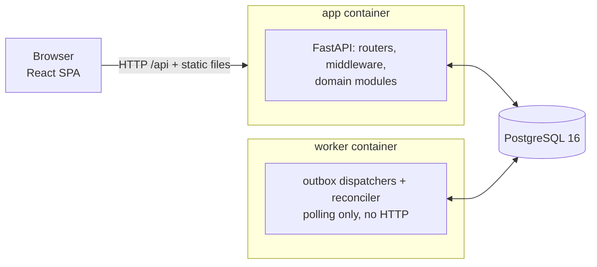

# Architecture

How the system is structured, how checkout and import flow through it, and what happens when something fails. The reasoning behind each major choice is in the [ADRs](adr).

## 1. System at a glance



- **One image, two roles.** The `app` container serves the API and the built SPA (no CORS). The same image runs as a `worker` that delivers side effects and settles stuck payments. `docker compose up` starts both plus Postgres.
- **Why a separate worker.** Background work would otherwise share the API's single Python core with checkout requests. More throughput means more worker containers (`make up WORKERS=N`); they claim work with `SKIP LOCKED`, and only one reconciler is active at a time (advisory lock).

## 2. Repository structure

```
backend/app/
  core/        settings, async DB, problem+json errors, JSON logging, upload size limit
  events/      transactional outbox, idempotent handler registry, dispatcher
  payments/    PaymentProvider port and a fake provider with its own table
  catalog/     products, categories, normalization, search
  inventory/   reservations, append-only stock ledger, low-stock alerts, invariants
  importing/   streaming CSV parser, import service, upload store
  orders/      checkout saga, state machine, reconciler, notifications, invariants
  api/         HTTP routers only
  bootstrap.py wiring (builds the Container, registers handlers)
  main.py      HTTP app;  worker.py  background process;  cli.py  import and seed
frontend/src/  api client, features (shop, cart, checkout, orders, admin), lib (money, idempotency)
scripts/       chaos.py (kill the app mid-checkout), bench.py (latency and throughput)
```

## 3. Module layers

```
app.api → app.orders | app.importing → app.inventory → app.catalog → app.payments | app.events → app.core
```

Higher layers may import lower ones, never the reverse; `import-linter` enforces this in CI. `payments` and `events` know no domain module, so the payment adapter and event transport are swappable. Stock belongs to `inventory`: `catalog` never writes the `stock` column.

## 4. Data model

| Table | Purpose | Key constraint |
|---|---|---|
| `products` | catalog plus cached stock balance | `CHECK (stock >= 0)`; unique `sku` among non-deleted rows; `version` for optimistic locking |
| `stock_movements` | append-only ledger (`delta`, `balance_after`, `reason`, reference) | trigger rejects `UPDATE` and `DELETE` |
| `stock_reservations` | stock held by an order (`active → committed / released`) | |
| `orders`, `order_items` | orders with snapshot SKU, name and price | unique `idempotency_key` |
| `outbox_events`, `processed_events` | side effects to deliver; inbox of handled events | primary key `(handler, event_id)` |
| `import_runs`, `import_issues` | audit of every import and its per-row problems | |
| `payment_sim_charges` | the fake provider's own store, keyed `order-{id}` | |

## 5. Checkout: an orchestrated saga (`orders/checkout.py`)

1. **Replay check.** The same `Idempotency-Key` and request returns the existing order (`200`); the same key with a different cart returns `422`.
2. **Transaction 1, reserve.** Insert the order as `pending_payment` and reserve each line with a conditional `UPDATE … WHERE stock >= qty`, writing reservation, ledger and outbox rows. A short line rolls everything back (`409`).
3. **Charge** with no transaction open, using the key `order-{id}` and a ~3 s timeout. On timeout the API returns `202`.
4. **Transaction 2, settle.** A conditional transition to `paid`, or to `payment_failed` with the stock released.
5. **Reconciler.** For stale pending orders it asks the provider first: settle as paid or failed, or expire and release stock after the reservation TTL. A success after expiry raises `RefundRequired`.

| Failure point | What happens | Covered by |
|---|---|---|
| Double-click or network retry | Same key returns the same order | `test_concurrent_double_submit_creates_one_order` |
| Two buyers, one unit | One `UPDATE` wins; the other gets `409` | `test_last_unit_is_sold_exactly_once` |
| Crash after reserving, before charging | Reconciler finds no charge, expires the order, releases stock | `test_crash_after_reserve_is_expired_and_stock_released` |
| Crash after charging, before settling | Reconciler finds the charge and marks the order `paid` | `test_crash_after_charge_is_reconciled_to_paid` |
| Slow provider | `202` now, `paid` later | `test_slow_provider_returns_202_and_reconciler_settles` |
| Charge succeeds after the order expired | No silent capture: `RefundRequired` and an invariant flag it | `test_late_payment_after_expiry_flags_refund` |
| Checkout and reconciler race | Transitions are `UPDATE … WHERE status = 'pending_payment'`; exactly one wins | `test_settling_twice_is_harmless` |
| Opposite-order carts | Lines are locked in ascending product id; no deadlock | `test_opposite_cart_order_does_not_deadlock` |

## 6. CSV import (`importing/`)

Upload → size guard (`413`) → stream to disk with a SHA-256 → detect encoding → parse in batches of 500 → dry run (classify only) or apply (upsert, ledger, outbox and issues, one transaction per batch) → issue preview plus a downloadable CSV. Confirming a dry run applies the stored file by run id. Details and rules: [ADR 0005](adr/0005-partial-success-import.md).

## 7. Side effects: the transactional outbox (`events/`)

Every state change writes its events in the same transaction, so a side effect is never lost and never fires for a rolled-back change. Dispatchers in the worker claim batches with `SKIP LOCKED`, run each event in its own savepoint, skip handlers already recorded in `processed_events`, retry with backoff and dead-letter after repeated failures (retryable from the System page).

| Event | Written with | Handler |
|---|---|---|
| `inventory.StockChanged` | every ledger row | `sync_stock_alert`: re-reads stock and converges the alert table |
| `orders.OrderPaid`, `OrderPaymentFailed`, `OrderExpired` | the order's status change | `send_order_notification` |
| `orders.OrderPlaced`, `orders.RefundRequired` | checkout | none yet: hooks for integrations |

Payment itself is not an outbox command: the buyer needs the answer now, and the crash gap is covered by the idempotency key and the reconciler.

## 8. Cross-cutting concerns

- **Money:** `NUMERIC(12,2)` and `Decimal`, JSON strings, integer cents in the UI; order prices come from the database.
- **Concurrency:** short transactions only, no transaction held across the payment call, optimistic locking (`version`, `expected_stock`) for admin edits.
- **Errors:** `DomainError` subclasses render as RFC 7807 `problem+json` with a `type` the UI matches on; no stack traces leak.
- **Observability:** JSON logs with request ids, `/healthz` and `/readyz`, and the System page (invariants, outbox lag, alerts).

## 9. Testing

All integration tests run on real Postgres, because SQLite would hide the locking and search behavior under test. Layers: unit, property-based fuzzing of the importer, integration, concurrency races, and a Hypothesis state machine that interleaves imports, checkouts, crashes, reconciliation and event delivery, checking every invariant after every step. `make chaos` and `make bench` add evidence against a running stack ([chaos](chaos.md), [benchmarks](benchmarks.md)).
