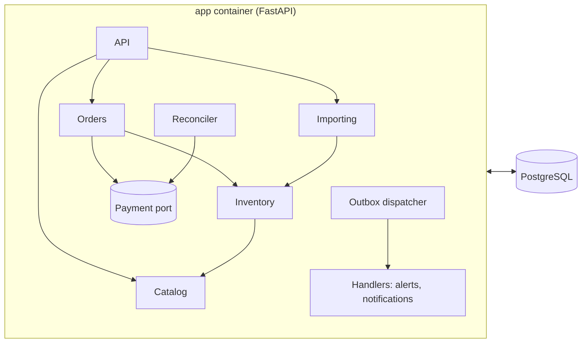
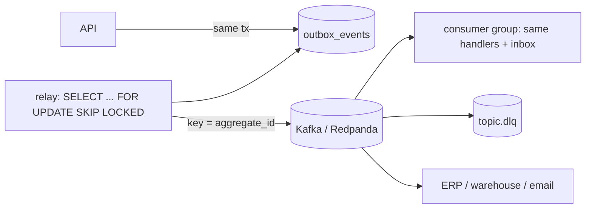
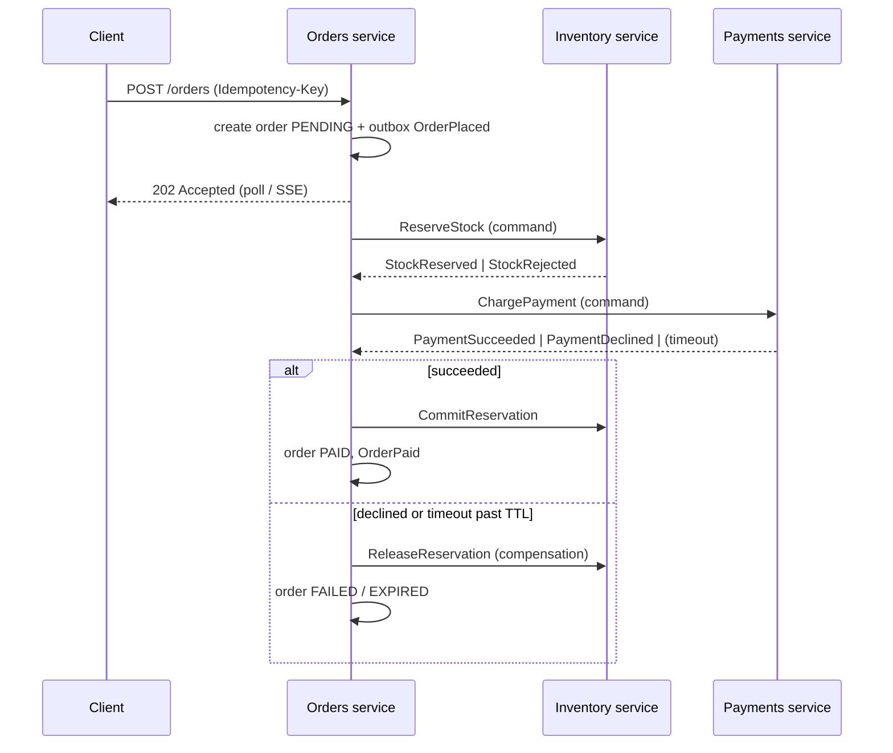

# Evolution path: from modular monolith to event-driven services

This app is deliberately a **modular monolith with a transactional outbox** ([ADR 0002](adr/0002-modular-monolith.md), [ADR 0003](adr/0003-checkout-saga-and-outbox.md)). This document shows that the design is ready to evolve, and what would trigger each step. Building these steps today would trade the ACID guarantees of one database for eventual consistency, with nothing gained in return.

## Stage 0: today

- Events are rows in `outbox_events`, written in the same transaction as the change.
- An in-process dispatcher delivers them to handlers that are idempotent through the `processed_events` inbox.

## Stage 1: add a broker without touching domain code

**Trigger:** another system needs our events (ERP, data warehouse, email service), or side-effect handlers need to scale separately from the API.

| Concern | How it is handled |
|---|---|
| Dual write (DB + broker) | Already solved: the relay publishes committed outbox rows only. |
| Ordering | Message key = `aggregate_id`, so all events of one order or product share a partition. Handlers already re-read current state ([alert handler](../backend/app/inventory/handlers.py)), so out-of-order delivery converges anyway. |
| At-least-once delivery | The relay marks a row `published_at` after the broker acks. Duplicates are absorbed by the inbox table. |
| Poison messages | N retries with backoff, then `<topic>.dlq` with error headers, plus an admin retry, which already exists for the in-process path. |
| Schema evolution | Every envelope carries `event_type` and `event_version`. Consumers accept the current and previous version. |

The code change is a relay process plus a consumer loop that calls the existing registry. Checkout, the outbox and the handlers do not change.

## Stage 2: extract services and run checkout as a distributed saga

**Trigger:** separate teams own payments or inventory, their release cadence or scaling diverges, or regulatory scope (PCI) requires isolating payments.

| Step | Action | Compensation | Idempotency key |
|---|---|---|---|
| 1 | Create order `PENDING` | Mark `EXPIRED` | Client `Idempotency-Key` |
| 2 | Reserve stock | Release reservation | `order_id + product_id` |
| 3 | Charge payment | Refund (if charged after expiry) | `order_id` |
| 4 | Commit reservation, mark `PAID` | (terminal) | `order_id` |

### Failure-mode analysis

| Failure | Effect | Mitigation |
|---|---|---|
| Relay crashes after publish, before marking the row | Event published twice | Inbox dedup in consumers |
| Consumer crashes mid-handler | Message redelivered | Handler and inbox insert are in one transaction |
| Payment service never answers | Order stuck `PENDING` | Saga timeout, then query provider status, then expire and release (today's reconciler) |
| Payment succeeds after expiry | Customer charged, order expired | `RefundRequired` event, then automated refund (today it is flagged) |
| Inventory and orders disagree | Drift | Periodic reconciliation job, using today's invariant SQL across services |
| Poison event | Partition blocked | Bounded retries, then DLQ with alerting |

## Choosing the transport when the time comes

| Option | Strength | Weakness | Fit |
|---|---|---|---|
| **Kafka / Redpanda** | Durable log, replay, fan-out to many consumers, high throughput | Heavier to operate; awkward for request/reply commands | Domain events to many subscribers, analytics |
| **RabbitMQ** | Routing, per-message acks, natural for commands and work queues | No replay; less suited to event streaming | Command-style saga steps |
| **Temporal** | Durable workflows with timers, retries and visibility built in | New runtime and programming model | Long-running sagas across many services |
| **Postgres outbox + LISTEN/NOTIFY** | Zero new infrastructure (today's design, plus instant wake-ups) | One database; not for cross-team integration | Single-service deployments |

The likely end state is Kafka for domain events plus Temporal (or a dedicated orchestrator) for the checkout saga. The outbox stays either way.

## Checkout scaling ladder

| Step | Trigger | Change |
|---|---|---|
| 1. Measure | Always | `make bench` (hot-product p95 and throughput) |
| 2. Pooling and short transactions | Connection saturation | PgBouncer (transaction mode); the lock window is already about 1–5 ms |
| 3. Multiple app replicas | CPU-bound API | Stateless app; dispatcher and reconciler are safe to run on every replica (`SKIP LOCKED` plus conditional transitions) |
| 4. Hot-row splitting | One product dominates (flash sale) | Split its stock into N bucket rows and reserve from a random bucket |
| 5. Redis gate | Flash-sale scale | Atomic `DECRBY` gate in front of Postgres; Postgres stays the source of truth |
| 6. Async checkout | Payment latency or spikes | Return `202` with a queue-based saga (stage 2); the client already handles `202` and polling |
| 7. Virtual waiting room | Extreme spikes | Admission control before checkout |
