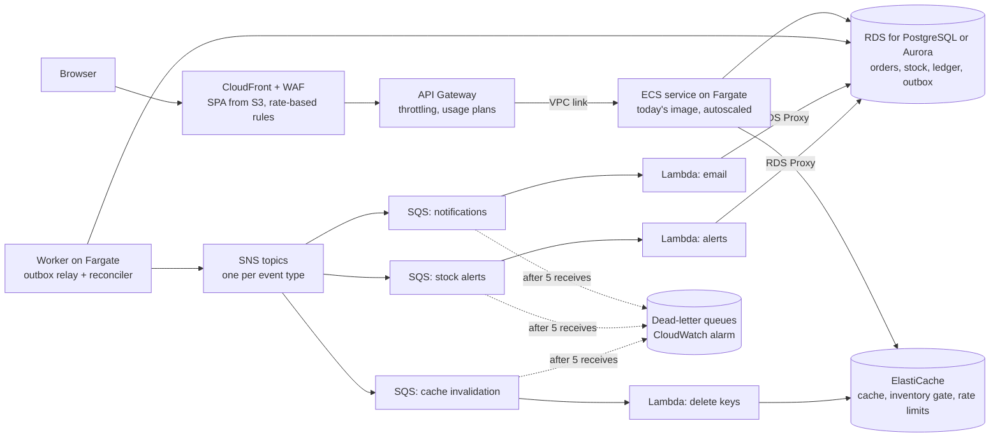
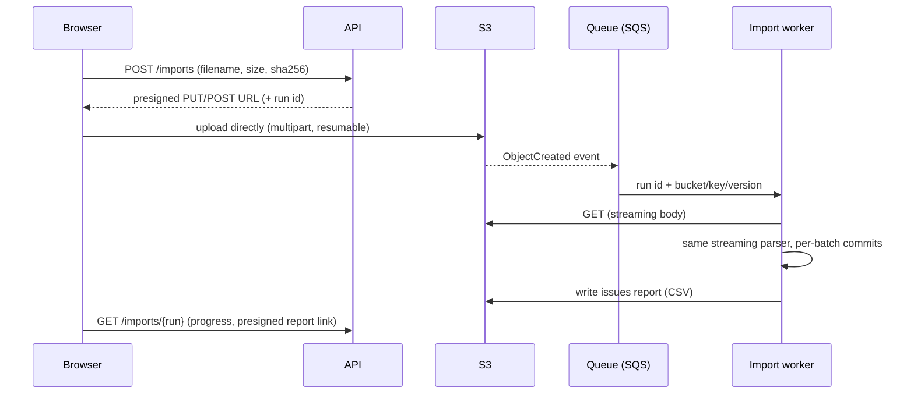
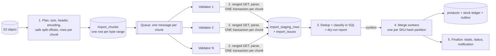
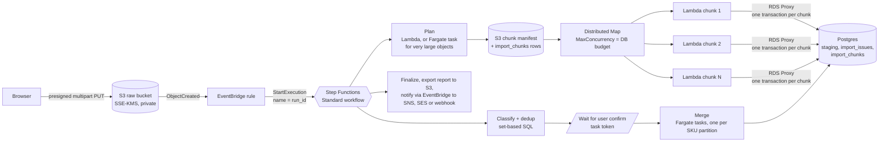

# Scaling and improvements: recommended, not built

Everything in the [README](../README.md) is built and tested. **Everything in this document is a recommendation:** what I would change at larger scale or with more time, the signal that would make it worth doing, and what in the codebase already prepares for it. Writing it down instead of building it is deliberate. The project has to run with one Docker command, and building infrastructure before there's a need for it trades simplicity for nothing.

## What holds today

- **Checkout under load:** the row lock lives only inside the reservation transaction (about 1–5 ms), with the payment call outside it. One hot product reaches 85% of contention-free throughput ([benchmarks](benchmarks.md)).
- **Event delivery scales by worker container.** Each container's 4 dispatcher tasks share one event loop, so one CPU core. Measured: **1,223 → 2,343 → 3,511 events/s** with 1, 2 and 4 containers ([ADR 0003](adr/0003-checkout-saga-and-outbox.md)).
- **Multiple replicas are already safe:** the dispatcher claims events with `SKIP LOCKED`, every order transition is conditional, per-product advisory locks keep parallel alert handling convergent, and only one reconciler is active at a time.
- **New side effects plug in without touching checkout:** one idempotent handler on an existing event ([Events](architecture.md#events-where-the-outbox-is-used-and-how-it-grows)).
- **Imports stream** with bounded memory and commit per batch, so they never hold locks on products being sold.

## Summary

| Improvement | Worth doing when… | Already in place |
|---|---|---|
| [The whole shop at scale on AWS](#running-the-whole-shop-at-scale): rate limiting, a Redis cache and inventory gate, SQS with dead-letter queues, retries with backoff; API Gateway, ECS on Fargate, Lambda, RDS or DynamoDB | traffic outgrows one database and a few containers, flash sales hit a few products, or public APIs need rate limits | idempotency keys, the conditional stock update, the outbox with retries and dead-lettering, the `202` path |
| [Search at scale](#search-at-scale-a-search-engine-then-semantic-search): Elasticsearch or OpenSearch, then hybrid semantic search with pgvector or OpenSearch k-NN | millions of products, several languages, merchandising rules, or many zero-result searches for descriptive queries | one search entry point to put behind a port, outbox events on every product and stock change, benchmarks with `EXPLAIN` |
| [Load and burst testing with k6](#load-and-burst-testing-with-k6) | capacity planning, a launch or a flash sale, or performance checks in CI | the local benchmark scripts as a baseline, `GET /api/admin/invariants` as the correctness check after a run, `make seed-large` for production-sized data |
| [Presigned uploads straight to S3](#production-path-for-very-large-files-upload-straight-to-s3) | files exceed ~200 MB, clients have slow connections, or API bandwidth matters | the `UploadStore` port, streaming parser, apply-by-run-id |
| [Parallel chunked imports on AWS](#scaling-to-gigabyte-files-and-many-concurrent-users-parallel-chunked-imports) (S3 + Step Functions + Lambda + Fargate) | gigabyte files, or many tenants importing at once; sequential imports take hours | the pure row parser, the `import_issues` table, per-batch atomic commits, dry run → confirm |
| [One disk write per upload instead of two](#upload-path-one-disk-write-instead-of-two) | uploads through the API routinely reach gigabytes | three size guards, the chunked store with a SHA-256 |
| [Checkout scaling ladder](#checkout-at-scale) | hot-product p95, or database connections near their limits | short lock window (85% hot-row efficiency), multi-replica safety |
| [Kafka or another message broker](#event-streaming-with-a-message-broker-option-b) | other systems consume our events, or several consumers need replay and fan-out | transactional outbox, transport-agnostic idempotent handlers, a separate worker container that becomes the relay |
| [Outbox at scale](#outbox-at-scale) | millions of events a day, sub-second side effects, or a handler that needs strict ordering | a partial pending index, `oldest_pending_seconds`, dead-letter retry, convergent handlers |
| [Authentication and roles](../README.md#security-scope) | any deployment beyond a local demo | grouped admin and import routers, every admin page under `/admin` |
| [Real payments, observability, search, deploys](#product-and-platform-next-steps) | before any real production deployment | the `PaymentProvider` port, correlation ids, the invariants endpoint |

## Running the whole shop at scale

The pieces that matter at scale already exist in the code, so each step below adds infrastructure, not a rewrite:
- every checkout carries an `Idempotency-Key`, so any layer can retry safely;
- stock only changes through one conditional `UPDATE`, so nothing oversells, whatever sits in front of it;
- side effects leave through the transactional outbox, which already retries with backoff and dead-letters;
- a slow payment already returns `202`, and the reconciler settles it.

Adopt these in order, each when its trigger appears:
1. rate limiting at the edge;
2. a Redis read cache;
3. SQS with dead-letter queues for side effects;
4. a Redis inventory gate for flash sales;
5. asynchronous checkout through SQS.

### Reliability and protection patterns

| Pattern | Built today | At scale | Worth doing when… |
|---|---|---|---|
| **Dead-letter queues** | An outbox event that fails 5 times is dead-lettered (`failed_at`) and can be retried from the System page | One SQS queue per consumer, each with a DLQ through a redrive policy (`maxReceiveCount` 5). A CloudWatch alarm fires as soon as a DLQ isn't empty, and after a fix, SQS redrive moves the messages back to their queue | side effects move to queues, or another team consumes the events |
| **Retry with backoff** | The outbox retries after 2, 4, 8 and 16 s. The client keeps its idempotency key on network errors and 5xx | Exponential backoff **with full jitter** everywhere, `sleep = random(0, min(cap, base × 2^attempt))`, so retries from many workers don't arrive in waves. The payment call retries with the same provider key (`order-{id}`), behind a circuit breaker that fails fast to `202` and leaves the order to the reconciler | the payment provider or AWS services return transient errors under load |
| **Rate limiting** | None | Three layers: AWS WAF rate-based rules per IP at the edge; API Gateway throttling per stage and route, plus usage plans per API key for partner clients; a Redis token bucket per user or IP and per endpoint in the app (strict on checkout, loose on search, a concurrency cap per tenant on imports). Over the limit, the API answers `429` with `Retry-After`. The frontend would treat `429` like a 5xx and retry with the same key, a one-line change in `ApiError.isRetryable` | public traffic, bots, scraping, or one tenant flooding imports |
| **Redis read cache** | None: Postgres serves every read | ElastiCache (Redis OSS or Valkey) as a cache-aside layer for product pages, categories and popular searches, with a short TTL. A handler on `inventory.StockChanged` and product edits deletes the affected keys; the outbox already emits those events. A stale stock badge can't oversell, because checkout re-validates against Postgres | reads dominate Postgres CPU |
| **Redis inventory gate** | The conditional `UPDATE … WHERE stock >= qty`; one hot row reaches 85% of contention-free throughput | An atomic check-and-decrement per SKU in front of Postgres, switched on per product for a sale (below). Postgres stays the source of truth and keeps the ledger | a flash sale concentrates traffic on a few products ([ladder step 5](evolution.md#checkout-scaling-ladder)) |
| **Asynchronous checkout** | The synchronous path, with a `202` fallback | `POST /orders` stores the order and an outbox message, then answers `202` at once. Workers consume an SQS queue and reserve and charge with backoff. After N attempts the message goes to a DLQ, and the reconciler expires the order and releases its stock. The UI already polls on `202` | payment latency or traffic spikes exceed what synchronous requests can hold ([ladder step 6](evolution.md#checkout-scaling-ladder)) |

### The Redis inventory gate

```lua
local available = redis.call("GET", KEYS[1])
if not available then
  return -2
end
local wanted = tonumber(ARGV[1])
if tonumber(available) < wanted then
  return -1
end
return redis.call("DECRBY", KEYS[1], wanted)
```

- **Admission, not truth.** A successful decrement only lets the request reach Postgres, where the conditional `UPDATE` still decides. Over-admitting is harmless; under-admitting only delays sales until the next reconciliation. `-2` means the product has no gate, so the request goes straight to Postgres.
- **Compensation mirrors the saga.** A decline, an expiry or a failed transaction adds the units back with `INCRBY`, in the same places that release stock in Postgres today.
- **Reconciliation.** The counter is rebuilt from Postgres (stock minus active reservations) when the gate is switched on and every minute during the sale, so drift from crashes heals on its own.
- **Scope.** One key per SKU (`stock:{sku}`), so Redis Cluster spreads hot products across shards, and the script touches a single key, as cluster mode requires. Only products flagged for a sale go through the gate.

### AWS reference architecture



| Concern | AWS service | Settings and why |
|---|---|---|
| SPA and edge | S3 and CloudFront, AWS WAF | The static app is served from the edge and leaves the API. WAF adds managed rule groups and per-IP rate-based rules |
| API entry | API Gateway | Stage and route throttling; usage plans with API keys (REST API) for partner clients, such as an ERP pushing catalog files; a JWT authorizer once single sign-on exists ([ADR 0008](adr/0008-security-scope.md)); a VPC link to the service's load balancer |
| API compute | ECS service on Fargate | The same image as today, with target-tracking autoscaling on CPU and request count. Long-lived pools keep Postgres connections steady, which suits checkout better than a Lambda per request |
| Background work | ECS on Fargate | Today's `worker` container: the outbox relay (Postgres to SNS) and the reconciler, still single-active through the advisory lock |
| Messaging | SNS fanning out to SQS, one queue per consumer, each with a DLQ | At-least-once delivery is fine, because handlers are idempotent through the inbox table. FIFO queues with `MessageGroupId` set to the aggregate id only where a consumer needs ordering |
| Event handlers | Lambda on the SQS queues | Partial batch responses, so one bad message doesn't retry the whole batch; a maximum concurrency on the event source to bound database load; RDS Proxy to pool connections; a queue visibility timeout of at least 6× the function timeout |
| Database | RDS for PostgreSQL or Aurora PostgreSQL, Multi-AZ | Read replicas for search and admin reads; RDS Proxy in front; `outbox_events` and `stock_movements` partitioned by month |
| Cache and counters | ElastiCache (Redis OSS or Valkey), cluster mode | The read cache, the inventory gate and the token buckets |
| Imports | S3, Step Functions, Lambda and Fargate | The [parallel import design](#scaling-to-gigabyte-files-and-many-concurrent-users-parallel-chunked-imports) below |
| Operations | CloudWatch, X-Ray or OpenTelemetry, Secrets Manager | Alarms on DLQ depth, outbox lag (`oldest_pending_seconds`), checkout p95 and failed invariants; rotated database credentials |

### DynamoDB or RDS for PostgreSQL?

**Keep PostgreSQL, on RDS or Aurora, as the system of record, and use DynamoDB only beside it.** Checkout depends on multi-row ACID transactions, the conditional stock update, the ledger written in the same transaction, `SKIP LOCKED` queues and full-text search, and Postgres provides all of them today.

| | RDS or Aurora PostgreSQL | DynamoDB |
|---|---|---|
| Checkout consistency | Multi-table transactions; today's code unchanged | `TransactWriteItems`, up to 100 items per transaction |
| Stock decrement | Conditional `UPDATE … WHERE stock >= qty` (built) | `UpdateItem` with `ConditionExpression: stock >= :qty` |
| Side effects | The outbox, in the same transaction (built) | DynamoDB Streams to Lambda; the stream becomes the outbox |
| Search and admin queries | Full-text and trigram search, ad-hoc SQL, the invariants (built) | OpenSearch for search, and precomputed access patterns for admin views |
| Scaling | Vertical, plus up to 15 read replicas on Aurora | Horizontal and on demand, with steady latency at any size |
| Best fit here | Orders, stock, the ledger, imports | Idempotency records with a TTL, carts, sessions, high-volume counters |

A DynamoDB-first design is possible, but it would rewrite the domain layer for a scale the shop doesn't have. The trigger would be write traffic, or multi-region requirements, beyond what Aurora handles.

## Search at scale: a search engine, then semantic search

Today's search is Postgres full-text plus trigram matching, with a fuzzy fallback ([ADR 0007](adr/0007-search.md)). On 100k products, an exact SKU or a filter answers in about 5 ms and a typo in about 60 ms ([benchmarks](benchmarks.md)). It needs no extra infrastructure, and it's enough for a catalog where people type product names. Two steps take it further, each when its trigger shows up.

### Step 1: Elasticsearch or OpenSearch

| | |
|---|---|
| Worth doing when… | millions of products; several languages, each with its own stemming; merchandisers who want boosts, pinned results and synonyms ("tee" means "t-shirt"); facet counts on many fields; type-ahead under 50 ms |
| How it plugs in | Postgres stays the source of truth, and the index is a read model. A handler on product changes and `inventory.StockChanged`, delivered by the outbox that already exists, re-reads the product and writes the whole document. It uses the product's `version` as the external version, so a late update can't overwrite a newer one. A scheduled full reindex into a new index, followed by an alias swap, heals any drift |
| The seam | `catalog.search_products()` is the only search entry point, so it becomes a port with a Postgres adapter and an engine adapter, like `PaymentProvider` and `UploadStore`. The API (`GET /api/products?q=`) doesn't change |
| Consistency | The index can lag behind stock by a second or two. That's acceptable: checkout re-validates stock in Postgres, so a stale "in stock" badge can't oversell |
| On AWS | Amazon OpenSearch Service, or OpenSearch Serverless for spiky traffic. Meilisearch or Typesense are simpler choices for a small team that doesn't need OpenSearch's scale |

### Step 2: semantic search, combined with keyword search

Keyword search matches words; semantic search matches meaning. An embedding model turns each product's name, description and category into a vector, the query becomes a vector the same way, and the nearest products come back. "Something to keep coffee hot" finds the thermos flask and the travel mug, and "a gift for a runner" finds running shoes and a fitness tracker, although neither query shares a word with those products.

It should be **hybrid**, never semantic alone. Vectors are weak at exact tokens such as SKUs (`GK-088`), model numbers and brand names, which is exactly where keyword search is strong. Both searches run, and their result lists are merged with reciprocal rank fusion, which works on ranks, so the two kinds of score never need to be comparable. An exact SKU match still comes first.

| Option | Fits when | Notes |
|---|---|---|
| **pgvector in the same Postgres** | up to a few million products, with no search engine yet | No new datastore: an `embedding vector(1024)` column with an HNSW index, and the fusion done in SQL next to today's `tsvector` query. Supported on RDS and Aurora PostgreSQL |
| **OpenSearch k-NN** | Step 1 is already in place | A `knn_vector` field in the same index, and a hybrid query that combines the keyword and vector results in one request |

The fusion in Postgres, with `:query_embedding` computed by the same model as the product embeddings:

```sql
WITH keyword AS (
  SELECT id, row_number() OVER (ORDER BY rank DESC) AS r
  FROM (
    SELECT id, ts_rank_cd(search_vector, query) AS rank
    FROM products, to_tsquery('english', :tsquery) AS query
    WHERE search_vector @@ query AND deleted_at IS NULL
    ORDER BY rank DESC
    LIMIT 50
  ) matched
),
semantic AS (
  SELECT id, row_number() OVER (ORDER BY distance) AS r
  FROM (
    SELECT id, embedding <=> :query_embedding AS distance
    FROM products
    WHERE deleted_at IS NULL
    ORDER BY distance
    LIMIT 50
  ) nearest
)
SELECT id, sum(1.0 / (60 + r)) AS score
FROM (SELECT id, r FROM keyword UNION ALL SELECT id, r FROM semantic) ranked
GROUP BY id
ORDER BY score DESC
LIMIT 20;
```

What it takes:
- **Embeddings.** A handler on product changes computes the vector, delivered by the outbox like every other side effect, and a batch job fills in the existing catalog. The model can come from Amazon Bedrock (Titan Text Embeddings or Cohere Embed) or be a self-hosted sentence-transformer. Each vector records its model and version, because changing the model means re-embedding everything.
- **Query latency.** Embedding the query adds tens of milliseconds, so the vectors of popular queries are cached in Redis.
- **Measuring before switching.** A set of real queries with judged results compares keyword and hybrid offline (recall@k and NDCG@10), then an A/B test compares click-through and conversion. Keyword search stays as the fallback when the embedding service is down.
- **Worth doing when** search logs show many zero-result or abandoned searches for long, descriptive queries, or the catalog spans languages. Logging each query with its result count, which the API already computes, is the cheap first step either way.

## Load and burst testing with k6

The numbers in [benchmarks.md](benchmarks.md) and the outbox drain rates come from small Python scripts (`scripts/bench.py` and `scripts/drain_bench.py`), run on the same laptop as the stack. They were enough to compare designs locally: one hot row against spread load, a query plan, or the drain rate per worker container. They aren't a load test. The client shares the CPU with the system under test, it sends a fixed batch of requests rather than holding a target arrival rate, and it has no pass or fail criteria.

For capacity planning and burst tests at scale, I'd use [k6](https://k6.io):
- **Arrival-rate executors.** `ramping-arrival-rate` drives a set number of requests per second however slowly the server answers. That models a flash sale honestly and avoids coordinated omission, where a slow server quietly lowers the load it receives.
- **Thresholds as pass or fail criteria.** For example p95 under 500 ms, p99 under 1.5 s and fewer than 1% errors, with `409` (out of stock) declared an expected status, so a sold-out product doesn't count as a failure. A broken threshold fails the run, so the same test can gate CI.
- **Several scenarios in one run.** Browsing and search in the background, with a checkout burst on one hot product on top, each with its own rate and tags.
- **Results next to the system's own metrics.** Output to Prometheus and Grafana, or to CloudWatch, beside checkout p95, outbox lag and database load.

| Test | Shape | What it proves |
|---|---|---|
| Smoke | a few virtual users for a minute, on every pull request, against the Docker stack | nothing broke, and the thresholds still hold |
| Load | the expected peak ([question 22](questions.md)), held for 15–30 minutes | the target throughput meets the latency thresholds |
| Burst | a ramp from the normal rate to 10× in 30 seconds on one hot product, each attempt with its own `Idempotency-Key` | only `201`, `202` and `409` come back, nothing is oversold, and whether the [Redis inventory gate](#the-redis-inventory-gate) is needed |
| Soak | steady load for several hours | no memory or connection leaks, and outbox lag (`oldest_pending_seconds`) stays flat |
| Import under load | a 1M-row import while the checkout scenario runs | checkout p95 holds while the importer commits its batches |

Every run ends the way `make chaos` does: `GET /api/admin/invariants` must pass, so a load test also proves the books still balance. k6 replaces the benchmark scripts, not `make chaos`, which kills the app mid-checkout to test recovery rather than capacity.

**Where to run it.** From separate machines, never the laptop that hosts the stack: EC2 instances or Fargate tasks in the same region as the target, the k6 Operator on Kubernetes, or Grafana Cloud k6 for very high load. Against a staging environment with production-sized data (`make seed-large` loads 100k products), and never against production without coordination.

## Production path for very large files: upload straight to S3

Streaming through the API is the right call for this project, which runs with one `docker compose up` and no cloud dependencies. In production I would take the API out of the data path entirely:



What a production design has to get right:
- **Presigned upload with a strict policy:**
  - short expiry (5–15 min);
  - `content-length-range` capped at the agreed maximum;
  - `Content-Type: text/csv`;
  - a key prefix scoped to the tenant and run (`imports/{tenant}/{run_id}.csv`);
  - server-side encryption (SSE-KMS).
- **Multipart upload** for big files: parallel parts, resumable after a network drop, per-part checksums (`x-amz-checksum-sha256`), and a lifecycle rule that aborts incomplete multipart uploads.
- **Event-driven, idempotent processing:**
  - S3 `ObjectCreated` → SQS (with a dead-letter queue) → a worker that is idempotent on bucket, key and version id, so a redelivered event never imports twice;
  - the run record is the single source of truth for status.
- **Integrity and safety before parsing:**
  - verify the checksum the client declared;
  - **malware scan** (e.g. GuardDuty Malware Protection for S3, or ClamAV) with a quarantine bucket;
  - the CSV-injection escaping already used for reports.
- **Progress, cancellation and backpressure:**
  - the worker updates `rows_processed`, and the UI polls or uses SSE instead of holding an HTTP request open for minutes;
  - a cancel flag is checked between batches;
  - the worker throttles itself (smaller batches, pauses) when checkout latency rises, so a 10M-row import never slows down buyers.
- **Reports as objects.** The worker writes the issue report to S3, and the UI downloads it through a short-lived presigned GET. Huge reports never pass through the API.
- **Retention and compliance:** lifecycle rules expire uploads and reports after N days; access is audited (who uploaded what, when); and since files may contain business data, the bucket is private, encrypted and versioned.
- **Gigabyte files and many concurrent users:** process the file in parallel byte-range chunks. Each chunk is recorded in the database atomically, and the report is simply a query. See the next section.
- **Notifications:** an email or webhook when a long import finishes, with a link to the run and its report.
- **Local development** with MinIO or LocalStack. In this codebase only one adapter changes: `UploadStore` is already a port (`LocalUploadStore` today), and the parser takes any binary stream.

## Scaling to gigabyte files and many concurrent users: parallel chunked imports

One streaming worker processes about 5–6k rows/s (measured above). A 5 GB file of about 40M rows would take roughly two hours sequentially, and one tenant's huge file would block everyone else's. The recommendation:
- split the S3 object into **byte-range chunks**;
- **validate the chunks in parallel**;
- commit each chunk's outcome to the database **atomically**: its valid rows, its errors, warnings and repeated rows, and its "done" marker, all in one transaction;
- because every issue is a database row, **the downloadable report is a query**.



| Phase | What happens | Parallelism | Atomic unit |
|---|---|---|---|
| **1. Plan** | `HEAD` for the size; read the header and detect the encoding from the first bytes; compute split offsets (e.g. every 64 MB), each chunk's `first_row`, and its byte range | one job | the run row plus every chunk row, in one transaction |
| **2. Validate** | each worker reads only its slice (`GetObject` with `Range: bytes=start-end`), parses it with the existing row parser, `COPY`s valid rows into staging, and inserts its issues | **N workers**, one per chunk message | **one transaction per chunk:** staging rows + issue rows + `chunk.status = 'validated'` |
| **3. Dedup and classify** | SQL over staging: `DISTINCT ON (sku) … ORDER BY sku, row` keeps the first occurrence, and every other row becomes a `duplicate_sku` issue; a join with `products` yields create / update / unchanged, reserved-stock and price-swing warnings | set-based, per SKU-hash partition | one transaction per partition |
| **4. Merge** (on confirm) | upsert products, write ledger rows and outbox events | **P workers, each owning a SKU-hash partition**, so two workers never touch the same product: no lock contention and no deadlocks between workers | one **short** transaction per batch (~5k rows) plus a progress marker, so checkouts are never blocked for long |
| **5. Finalize** | sum the chunk and partition counters into the run's totals, set its status, emit `ImportCompleted` → notification | one job, triggered by the last chunk or partition to complete | one transaction |

**Splitting a CSV safely: byte ranges cut rows in half**
- **Boundary rule.** A chunk owns every record that *starts* inside its range. The worker skips the partial record at its start (unless the range begins at byte 0) and reads past its end to finish its last record. These are the same semantics as S3 Select's `ScanRange`, implemented by the worker with plain ranged GETs. Don't build on S3 Select itself: it has been closed to new AWS customers since 2024, and `ScanRange` doesn't support newlines inside quoted fields anyway.
- **Quoted newlines are the trap.** A newline inside `"…"` looks like a record boundary. So the planner does one fast, **quote-aware sequential scan** (it only tracks quote parity, so it runs at disk or network speed). The scan computes exact safe offsets and each chunk's `first_row`, so every issue still reports the **real file row number**. If the scan is too costly for a given file, detect quoted newlines and fall back to the sequential streaming importer.
- **Header and encoding are decided once** by the planner and passed to every worker (a UTF-8 BOM can only appear at byte 0).
- **Compressed uploads (`.csv.gz`) can't be split by byte range.** Either require uncompressed uploads for the parallel path, accept several files per import (each file becomes chunks), or decompress and re-split once in the planner.

**Atomicity: a control table, plus one transaction per chunk**

Queues and orchestrators deliver work **at least once**, and workers can crash mid-chunk. Exactly-once *results* therefore come from the database, not from the messaging layer. A control table tracks every chunk:

```sql
CREATE TABLE import_chunks (
    run_id        uuid        NOT NULL REFERENCES import_runs (id),
    chunk_no      int         NOT NULL,
    byte_start    bigint      NOT NULL,
    byte_end      bigint      NOT NULL,
    first_row     bigint      NOT NULL,
    status        text        NOT NULL DEFAULT 'pending',
    attempts      int         NOT NULL DEFAULT 0,
    rows_total    int,
    rows_valid    int,
    errors        int,
    warnings      int,
    duplicates    int,
    worker_id     text,
    last_error    text,
    started_at    timestamptz,
    finished_at   timestamptz,
    PRIMARY KEY (run_id, chunk_no),
    CHECK (status IN ('pending', 'validated', 'failed'))
);
```

Each worker commits its chunk's valid rows, its problem rows (errors, warnings, repeated SKUs and so on) and its completion marker in **a single transaction**:

```sql
BEGIN;
SELECT status FROM import_chunks WHERE run_id = $1 AND chunk_no = $2 FOR UPDATE;
COPY import_staging_rows (run_id, chunk_no, row, sku, name, price, stock, weight_kg, category) FROM STDIN;
INSERT INTO import_issues (run_id, chunk_no, row, severity, category, field, value, message)
SELECT * FROM unnest($3::uuid[], $4::int[], $5::bigint[], $6::text[], $7::text[], $8::text[], $9::text[], $10::text[]);
UPDATE import_chunks
   SET status = 'validated', rows_total = $11, rows_valid = $12, errors = $13, warnings = $14,
       duplicates = $15, worker_id = $16, finished_at = now()
 WHERE run_id = $1 AND chunk_no = $2 AND status = 'pending';
COMMIT;
```

- **`FOR UPDATE` on the chunk row serialises duplicate deliveries.** A second worker for the same chunk waits, then sees `validated`, commits nothing and acknowledges its message.
- **A crash mid-chunk leaves no trace:** no staging rows, no issues, status still `pending`. The retry starts clean.
- **Partial results are impossible.** The report never shows a chunk's issues without its rows, or the reverse.
- **Merge uses the same pattern** with an `import_merge_batches (run_id, partition, batch_no, status, rows_upserted)` table. Each batch's product upserts, ledger rows, outbox events and its marker commit together.
- **Nothing reaches `products` before every chunk is `validated`,** so the dry-run report is complete and exact before the user confirms. This is today's dry-run → confirm flow, scaled out.
- A chunk that keeps failing is marked `failed` with `last_error` after N attempts. The run shows exactly which byte range and first row failed, and re-driving that chunk is safe.

**The issue table *is* the report: errors, warnings, repeated rows and more**

```sql
CREATE TABLE import_issues (
    run_id    uuid    NOT NULL,
    chunk_no  int     NOT NULL,
    row       bigint,
    severity  text    NOT NULL,
    category  text    NOT NULL,
    field     text,
    value     text,
    message   text    NOT NULL,
    created_at timestamptz NOT NULL DEFAULT now()
) PARTITION BY RANGE (created_at);

CREATE INDEX ON import_issues (run_id, category, row);
```

- **`category`** makes the report filterable. Examples:
  - errors: `invalid_price`, `unknown_stock`, `negative_value`, `non_usd_price`, `shifted_columns`, `invalid_sku`, `duplicate_sku` (repeated rows);
  - warnings: `price_change`, `reserved_stock`, `unit_converted`.
- **The summary is one `GROUP BY category, severity`.** The UI can show "1,204 invalid prices · 87 repeated SKUs · 15 shifted rows" instantly, even for 40M rows.
- **Downloads per category or severity:**
  - a streaming query for moderate sizes, which is what this app does today;
  - for huge reports, an export job writes CSV (or Parquet) to S3 with `COPY … TO STDOUT`, and the UI gets a short-lived presigned link, so report bytes never pass through the API.
- **Retention** by dropping old partitions, which is far cheaper than `DELETE`-ing millions of rows. The staging table is `UNLOGGED` (no WAL) and is truncated once the run is finalized.

**Many concurrent users**
- **Fair scheduling.** One 10 GB import must not starve fifty small ones:
  - per-tenant concurrency caps;
  - round-robin across runs;
  - a **fast lane**: files under a threshold (say 50 MB) skip the planner and use the current single-worker streaming importer.
- **Protect checkout.** Validation (phase 2) never touches `products`, so it runs at full parallelism. Only merge needs care:
  - a global cap on merge workers;
  - a database connection budget (PgBouncer);
  - batch sizes that shrink automatically when checkout p95 latency rises.
- **Autoscaling and quotas.** Workers scale on queue depth. The presign endpoint enforces per-tenant quotas (maximum file size, maximum concurrent runs) and rate limits.
- **Progress and cancellation.** Progress is `sum(validated bytes) / object size` from `import_chunks`, a real progress bar over polling or SSE. Cancelling sets the run to `cancelling`, and workers check it between batches.

### AWS reference implementation: S3 + EventBridge + Step Functions (Distributed Map) + Lambda + Fargate



| Step | AWS service | Key settings and why |
|---|---|---|
| Upload | S3, presigned **multipart** upload | Parallel, resumable parts with per-part checksums; a lifecycle rule aborts incomplete uploads |
| Trigger | S3 → **EventBridge** → `StartExecution` | The execution **name = run id**. Standard workflow names are unique per state machine for 90 days, so a duplicated S3 event cannot start a second import |
| Malware scan | GuardDuty Malware Protection for S3 | The workflow continues only once the object is tagged clean; infected files go to a quarantine bucket |
| Plan | **Lambda**; **Fargate** (`ecs:runTask.sync`) when the quote-aware scan could exceed Lambda's 15-minute limit | Writes the chunk manifest (byte ranges, `first_row`) to S3 and inserts every `import_chunks` row in one transaction |
| Validate chunks | **Step Functions Distributed Map** → **Lambda** per chunk | The item reader iterates the **manifest**, so each item is a small `{byte_start, byte_end, first_row}`. Never pass rows: state payloads are capped at 256 KB and every state transition is billed. `MaxConcurrency` is set from the database's connection and write budget, not from Lambda's ceiling. Child workflows are **Express** (cheaper for short work). `Retry` with exponential backoff and jitter. Results go to S3 via `ResultWriter` |
| Classify and dedup | Lambda running set-based SQL | Postgres does the heavy lifting; the function is a thin trigger |
| Confirm | `.waitForTaskToken` | The workflow **pauses** with the dry-run report ready. The token is stored on the run row, the API's *Confirm* calls `SendTaskSuccess`, *Cancel* calls `SendTaskFailure`, and a timeout matches upload retention (e.g. 24 h). No polling and no idle compute |
| Merge | **Fargate** tasks (`ecs:runTask.sync`) in a Map over SKU partitions, low `MaxConcurrency` (e.g. 4–8) | Long, steady, database-bound work: warm connection pools, no 15-minute cliff, adaptive batch sizes driven by a checkout-latency CloudWatch metric |
| Finalize and notify | Lambda → EventBridge `ImportCompleted` → SNS, SES or webhook | Totals come from `import_chunks` and `import_merge_batches`; the report is exported to S3 and offered through a presigned GET |
| Failure | `Catch` on every state → `MarkRunFailed`; Step Functions **redrive** | Redrive resumes from the failed state. Already `validated` chunks are skipped thanks to the control table, so retrying a 5,000-chunk run re-processes only what failed |

**An alternative entry for an always-on worker pool:** S3 → SQS → an **ECS service on Fargate** that polls the queue and auto-scales on queue depth. It's simpler, with no orchestrator, but you build retries, fan-out/fan-in, the confirmation pause and run-level visibility yourself. I'd start with Step Functions, because the workflow *is* the audit trail: every run shows each step, its input, its retries and its failures.

**The decisions behind the choice of services:**
1. **Parallelism is bounded by Postgres, not by Lambda.** 1,000 concurrent Lambdas opening connections would take the database down, checkout included. So: `MaxConcurrency` from a database budget, **RDS Proxy** for pooling, reserved concurrency on the functions, wide parallelism for validation (append-only writes to unlogged staging) and narrow parallelism for the merge (row locks on `products`).
2. **Exactly-once *effects* come from the database transaction** (the control table plus a conditional status update), not from the queue or the orchestrator, both of which are at-least-once.
3. **Pass references, not data:** byte ranges through Step Functions, bytes straight from S3 to the worker.
4. **Correct CSV splitting**: the quote-aware planner and real row numbers, with no naive cut on newlines.
5. **First-row-wins deduplication stays correct under parallelism**, because it's resolved in SQL by row number after validation.
6. **Human-in-the-loop confirmation** with a task token: the large-file version of today's dry run → confirm.
7. **Checkout comes first:** merge throttling tied to checkout latency, and an import never competes with buyers for row locks for long.
8. **Operations:**
   - observability: `run_id` as the correlation id in every log and trace (X-Ray), CloudWatch metrics per run (chunks done, rows/s, issues by category), alarms on failed executions;
   - least-privilege IAM: validators can only `GetObject` on the raw prefix;
   - S3 VPC endpoints, KMS, and database credentials in Secrets Manager.
9. **Knowing when not to use it.** Files under a threshold take the fast lane through the current single-worker importer, and this repository keeps the one-image design that was asked for. The pipeline is a documented recommendation, not code, for the same reason Kafka is ([evolution](evolution.md)).

**Rough sizing (estimates to verify with a benchmark, not measurements)**
- Sequential, as measured today: about 1M rows per 122 MB and about 5.7k rows/s, so 5 GB ≈ 40M rows ≈ 2 hours.
- Parallel:
  - validation scales with the number of workers, because each one reads its own range and `COPY` into an unlogged staging table is cheap;
  - the merge is bounded by Postgres write throughput, with partitioned set-based upserts and short transactions;
  - the target is **minutes, not hours**, for multi-GB files, without moving checkout latency;
  - chunk size keeps each Lambda well inside its 15-minute limit. Validation alone runs at roughly 70k rows/s per process (1M rows dry-run in ~15 s, including database lookups), so a 128 MB chunk (~1M rows) takes about 15–20 s.

**What carries over from this codebase**
- `parse_record` and the field parsers are pure functions, so chunk workers reuse them unchanged. The streaming parser already works on any binary stream, including a ranged S3 body.
- `UploadStore` is already a port. An S3 adapter adds `open_range(key, start, end)`.
- `import_issues` already exists and powers the preview and the streamed CSV. This design adds `category` and `chunk_no`.
- Today's per-batch commit with locked lookups becomes the merge phase. The `plan_cache_mode` lesson (AI log #8) applies to the merge queries too.
- Apply-by-run-id already separates "validate" from "confirm"; here, confirm starts phase 4 on data that has already been validated.

## Upload path: one disk write instead of two
Today an upload is on disk twice: Starlette's spool file, plus our durable copy for apply-by-run-id ([why](upload-path.md#6-the-trade-off-the-file-is-on-disk-twice)). The alternative is for the endpoint to read `request.stream()` and drive python-multipart itself, writing straight into the store. That gives one write, and the SHA-256, line count and UTF-8 check all computed *during* the upload, so the pre-pass read disappears.

It's deferred because we would own multipart edge cases Starlette already handles, and would describe the OpenAPI body by hand, to save a fraction of a second per 100 MB. At gigabyte scale, presigned S3 uploads (above) are the better step anyway.

## Checkout at scale
The escalation ladder, with the trigger for each step, is in [`docs/evolution.md`](evolution.md#checkout-scaling-ladder):
1. measure (`make bench`);
2. PgBouncer and short transactions;
3. more replicas;
4. split a hot product's stock across several rows;
5. a Redis gate for flash sales;
6. async checkout through a queue (the API already handles `202` and polling);
7. a virtual waiting room.

## Event streaming with a message broker (option B)
Stage 1 adds a relay that publishes committed outbox rows to Kafka or Redpanda, keyed by `aggregate_id`, with idempotent consumers and a dead-letter topic. Domain code and handlers don't change. Stage 2 extracts payments and inventory and runs checkout as a broker-driven saga. Stages, triggers, failure modes and the Kafka vs. RabbitMQ vs. Temporal comparison: [`docs/evolution.md`](evolution.md).

## Outbox at scale
- **Retention.** Published `outbox_events` and `processed_events` rows are kept forever. That's a useful audit trail here, and delivery doesn't slow down, because the pending index is partial (`WHERE published_at IS NULL AND failed_at IS NULL`). At volume:
  - partition `outbox_events` by month and drop old partitions;
  - keep `processed_events` only as long as the redelivery window.
- **Wake-ups instead of polling.** Idle dispatchers poll every second. A `NOTIFY outbox` after commit, with the workers on `LISTEN`, wakes them immediately; polling stays as the safety net.
- **Strict per-aggregate ordering across replicas.** No handler needs it today: they're convergent, and alerts take an advisory lock. If one ever does, give each worker a hash range of `aggregate_id`, the same idea as Kafka partitions.
- **Lag alerting.** Alert when `oldest_pending_seconds` passes a threshold or when anything is dead-lettered.

## Product and platform next steps
- **Authentication and roles:** designed in [Security scope](../README.md#security-scope) and [ADR 0008](adr/0008-security-scope.md).
- **A real payment provider** behind the existing `PaymentProvider` port, with webhook-driven settlement feeding the reconciler and automated refunds for `RefundRequired`.
- **Observability:**
  - Prometheus metrics: orders by status, checkout latency, outbox lag, import rows/s by category;
  - OpenTelemetry traces (`correlation_id` is already propagated);
  - an alert on `invariants.passed == false`.
- **Search:** keyset pagination for deep pages; then a dedicated engine and semantic search, as described in [Search at scale](#search-at-scale-a-search-engine-then-semantic-search).
- **Deploys:** run migrations as a separate deploy step instead of in the container entrypoint, once there is more than one replica.
