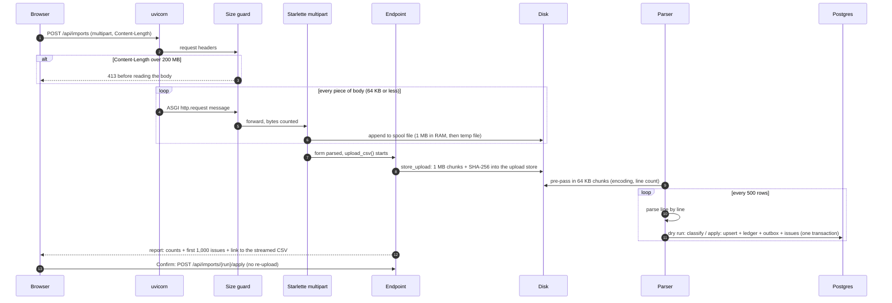

# How a CSV upload travels, hop by hop

This document follows the bytes of one upload from the browser to Postgres. It shows exactly what is streamed, what is buffered, where memory is bounded, and the one deliberate trade-off: the file is on disk twice. Every claim was checked against the installed library sources (FastAPI 0.142, Starlette 1.7, python-multipart 0.0.32, uvicorn) and against our own code.

```
browser ──TCP, Content-Length──▶ uvicorn ──ASGI messages (≤ ~64 KB)──▶ our size-limit middleware
   ──▶ Starlette multipart parser ──▶ copy #1: spool file (≤ 1 MB in RAM, then anonymous temp file)
                                                                      [all of this happens during the upload]
   ──▶ endpoint starts ──▶ store_upload: 1 MB chunks + SHA-256 ──▶ copy #2: /tmp/shop-imports/<uuid>.csv
   ──▶ pre-pass (64 KB chunks: encoding + line count) ──▶ parse line by line, batches of 500 ──▶ Postgres
```

The same path as a sequence diagram:



---

## 1. The browser: which headers, and how it streams

The frontend puts the `File` into a `FormData` and does **not** set `Content-Type` itself (see the `formData` branch in [`frontend/src/api/client.ts`](../frontend/src/api/client.ts)). The browser builds the request:

```http
POST /api/imports?dry_run=true HTTP/1.1
Content-Type: multipart/form-data; boundary=----WebKitFormBoundary7MA4YWxk
Content-Length: 12085342

------WebKitFormBoundary7MA4YWxk
Content-Disposition: form-data; name="file"; filename="products.csv"
Content-Type: text/csv

name,sku,description,category,price,stock,weight_kg
…the rest of the file's bytes…
------WebKitFormBoundary7MA4YWxk--
```

- **`Content-Type` carries the `boundary`**, the separator the server uses to find where the file starts and ends inside the body. If the frontend set this header by hand, the boundary would be missing and parsing would fail. That's why the browser is left to set it.
- **`Content-Length` is exact.** A `File` has a known size, so the browser sends a fixed length, **not** `Transfer-Encoding: chunked`. Chunked encoding is only used when the length is unknown, such as `fetch` with a `ReadableStream` body. Over HTTP/2 there is no chunked encoding at all, only DATA frames.
- **Both framings work.** A raw wire capture of the same file sent with `Content-Length` and with chunked encoding produced the same stored file (3,303 bytes, the same SHA-256), because uvicorn removes the chunk framing. `Content-Length` is still the better choice for uploads: it allows the instant `413` and gives the browser an exact total for progress bars.
- **Streaming:** the browser's network stack reads the file from disk piece by piece and writes it to the socket. JavaScript never holds the bytes. TCP flow control paces the upload to the speed at which the server reads.

## 2. The server, layer by layer

| Layer | What it does with the bytes | Where |
|---|---|---|
| **uvicorn** | Reads the socket and wraps each piece as an ASGI message `{"type": "http.request", "body": b"…", "more_body": True}`. When more than **64 KB** is buffered (`HIGH_WATER_LIMIT = 65536`), it **pauses reading the socket** until the app consumes it. That's real backpressure; the client simply waits. | `uvicorn/protocols/http/flow_control.py`, `httptools_impl.py` |
| **Our middleware** | Sees every message first and counts its bytes; enforces the size limit (section 4). | [`backend/app/core/limits.py`](../backend/app/core/limits.py) |
| **Starlette `Request.stream()`** | Loops `await receive()` and yields each `body` until `more_body` is `False`. | `starlette/requests.py` |
| **Starlette `MultiPartParser.parse()`** | Feeds each chunk to python-multipart's state machine, which finds the boundaries and fires callbacks. When a part's headers contain a `filename`, it creates `SpooledTemporaryFile(max_size=1 MB)`. The file's bytes are appended to it with `await part.file.write(data)`, which runs **in a threadpool** once the data is on disk, so the event loop isn't blocked. At the end of the part it calls `seek(0)`. | `starlette/formparsers.py` |

The spool file keeps the first **1 MB in RAM**. After that it rolls over to a real temp file in `/tmp`, which is *anonymous*: it is unlinked as soon as it's created, so it has no visible name. FastAPI registers `form.close()` on the request's exit stack, so this file is closed and vanishes when the request finishes.

### The nuance: the endpoint starts after the upload has finished
FastAPI awaits `request.form()` **before** it calls our endpoint (`fastapi/routing.py`: form parsing comes first, then `run_endpoint_function`). So `upload_csv` begins only once the whole upload has been received and spooled to disk. Memory stays bounded the whole time, but our parsing doesn't overlap with the network transfer. It wouldn't help much anyway: the pre-pass (encoding detection and line count) needs the complete file before any row can be safely applied.

## 3. Our code: copy, hash, parse

### `store_upload(file.file, filename)`: a chunked copy, not a load
`file.file` is Starlette's spool file. `store_upload` → `LocalUploadStore._save` runs in a worker thread (`asyncio.to_thread`, so checkouts stay responsive) and does this ([`backend/app/importing/storage.py`](../backend/app/importing/storage.py)):

```python
with target.open("wb") as sink:              # opening a file moves 0 bytes
    while chunk := source.read(1 << 20):     # read AT MOST 1 MB
        size += len(chunk)
        if size > max_bytes: raise ...       # size guard #3
        digest.update(chunk)                 # SHA-256 keeps a 32-byte state, not the data
        sink.write(chunk)                    # hand 1 MB to the OS; Python keeps nothing
                                             # next iteration replaces `chunk`; the old 1 MB is freed
```

Python holds **about 1 MB at any moment**, whether the file is 1 MB or 200 MB. Compare the original implementation, `data = await file.read(limit + 1)`: one `bytes` object as large as the file, followed by a decoded `str` copy and every parsed row kept in a list.

### Parsing the stored file
- **Pre-pass:** the file is read in **64 KB** chunks through an incremental UTF-8 decoder (falling back to Windows-1252) while newlines are counted. That's constant memory, and it rejects a too-large file before anything is written.
- **Parse:** `io.TextIOWrapper` → `csv.reader` reads **line by line**. Every 500 rows a batch is classified (dry run) or upserted and committed (apply).
- **Issues** are written to the `import_issues` table batch by batch. The response carries the first 1,000; the full report streams from a database cursor.

What memory still grows with is the duplicate-SKU index: about 100 bytes per *distinct* SKU. It doesn't grow with file size or row width.

## 4. Three size guards

| # | Guard | Triggers when | Cost to the server |
|---|---|---|---|
| 1 | `Content-Length` check in the middleware | the declared size is over the limit | **413 before reading a single byte.** Measured: a 230 MB upload got its 413 in 3 ms, with 0 bytes uploaded |
| 2 | Byte counting in the middleware | the header is missing or lies, and the counted bytes pass the limit | the upload stops at the limit with a `413` (raised as FastAPI's `HTTPException`, because FastAPI turns any other exception raised while reading the body into a `400`) |
| 3 | Byte counting in `store_upload` | defence in depth, if the code path changes in future | the partial file is deleted |

Browser caveat: when the server answers before the body has been fully sent, some browsers report a connection reset instead of showing the 413. The frontend checks the 200 MB limit itself before uploading.

## 5. Page cache vs. process memory

`sink.write(chunk)` hands bytes to the **kernel**. They sit in the OS page cache (RAM the kernel manages) until they're flushed to disk, and they're evicted under memory pressure. That memory is not the app's.

Measured during the 1M-row (122 MB) test in Docker:

| Metric | Value | Meaning |
|---|---|---|
| Container `memory.peak` | 452 MB | app memory **plus** the page cache for the uploaded file, which was written twice |
| `memory.stat` `anon` | ~120 MB | the app's own memory |
| `memory.stat` `file` | ~137 MB | page cache: the CSV's pages, reclaimable |
| uvicorn process `VmHWM` | **214 MB** | the app's real peak: the 1M-row dry run, plus building and streaming a 600k-issue report |

When someone says "Docker shows 452 MB", the answer is that the process peaked at 214 MB and the rest is reclaimable file cache.

## 6. The trade-off: the file is on disk twice

| | Copy #1: Starlette spool | Copy #2: upload store |
|---|---|---|
| Created by | the multipart parser, *while the upload arrives* | `store_upload`, *after* the endpoint starts |
| Location | `/tmp`, anonymous (unlinked, no name) | `/tmp/shop-imports/<uuid>.csv` |
| Lifetime | deleted when the request ends | kept 24 hours |
| Why it exists | Starlette's buffer for the multipart part | **apply-by-run-id** needs a named file that outlives the request, so "Confirm import" applies the reviewed bytes (same SHA-256) without a re-upload |

**Cost:** one extra sequential write, roughly 0.2–0.5 s for a 122 MB file on a laptop SSD. Memory is not affected.

### Alternative considered and deferred: write straight into the store
Our endpoint could read `request.stream()` itself and drive python-multipart's parser, writing the file part directly into the store. That means **one** disk write, with the SHA-256, line count and UTF-8 check all computed *during* the upload, so the pre-pass read disappears too.

It was deferred because:
- we would own multipart edge cases that Starlette already handles (boundaries, part headers, malformed bodies, cleanup on disconnect);
- the endpoint would no longer use FastAPI's `UploadFile`, so the OpenAPI request body would have to be described by hand;
- the gain is a fraction of a second per hundred megabytes.

It's worth revisiting if uploads routinely reach gigabytes. At that point, though, the better move is the [production path](scaling.md#production-path-for-very-large-files-upload-straight-to-s3): **presigned uploads straight to S3**, which take the API out of the data path entirely, followed by a worker that streams the object through the same parser.

## 7. Quick reference
- **Headers:** `Content-Type: multipart/form-data; boundary=…` plus an exact `Content-Length`. Not chunked, because a `File` has a known size.
- **Backpressure:** uvicorn pauses reading the socket above 64 KB buffered.
- **Starlette:** python-multipart's state machine writes into a `SpooledTemporaryFile` (1 MB in RAM, then disk), via a threadpool.
- **FastAPI:** parses the form before the endpoint runs, so our code starts after the upload has finished.
- **Our copy:** 1 MB chunks with a running SHA-256; `open("wb")` loads nothing.
- **Parsing:** a 64 KB pre-pass, then line by line, committing every 500 rows.
- **Memory:** about 1 MB per copy step; the parser grows only with distinct SKUs. The 214 MB process peak is the real number; Docker's 452 MB includes page cache.
- **Two copies on disk:** by design, for apply-by-run-id. The alternative is documented and deferred.

## 8. Every step at a glance

| # | Step | What happens | Memory held | Code |
|---|---|---|---|---|
| 1 | **Browser builds the request** | `FormData` with the `File`. The browser sets `Content-Type: multipart/form-data; boundary=…` and an **exact `Content-Length`**, never `Transfer-Encoding: chunked`. Captured from Chromium: a 3,303-byte CSV plus 191 bytes of multipart wrapping = `content-length: 3494` | none in JavaScript; the browser streams the file from disk | [`frontend/src/api/imports.ts`](../frontend/src/api/imports.ts) |
| 2 | **Size guard** | `Content-Length` over the limit → `413` before reading anything (230 MB: 3 ms, 0 bytes uploaded). With no length, or a false one, it counts bytes as they arrive and stops the upload with `413` at the limit | none | [`backend/app/core/limits.py`](../backend/app/core/limits.py) |
| 3 | **uvicorn** | Turns socket data into ASGI messages, and **pauses reading the socket** when more than 64 KB is buffered (backpressure: the browser slows down). If a client sends chunked, uvicorn strips the chunk framing, so the app only ever sees plain bytes | ≤ 64 KB | (uvicorn) |
| 4 | **Starlette multipart parser** | python-multipart's state machine finds the boundaries and appends the file bytes to a `SpooledTemporaryFile`: the first 1 MB in RAM, then an anonymous temp file, written from a threadpool | ≤ 1 MB | (Starlette) |
| 5 | **FastAPI → endpoint** | FastAPI parses the whole form **before** calling the endpoint, so our code starts once the upload has finished | none | [`backend/app/api/imports.py`](../backend/app/api/imports.py) |
| 6 | **`store_upload`** | Reads 1 MB, checks the size, updates the SHA-256, writes; repeat. The result is `/tmp/shop-imports/{uuid}.csv`, kept for 24 h. `open("wb")` itself moves no data | ~1 MB | [`backend/app/importing/storage.py`](../backend/app/importing/storage.py) |
| 7 | **Pre-pass** | Reads in 64 KB chunks through an incremental UTF-8 decoder (falling back to Windows-1252) and counts lines. A file with too many rows is rejected **before anything is written** | ~64 KB | `probe_file` in [`parsing.py`](../backend/app/importing/parsing.py) |
| 8 | **Parse and write** | `TextIOWrapper` → `csv.reader`, **line by line**. Every 500 rows, a dry run classifies the batch, or an apply upserts it with ledger rows, outbox events and issues in **one transaction** | one batch, plus the SKU index (~100 bytes per distinct SKU) | `CsvStream` in [`parsing.py`](../backend/app/importing/parsing.py), [`service.py`](../backend/app/importing/service.py) |
| 9 | **Report** | Issues go to `import_issues`. The response carries the counts and the **first 1,000** issues; the full CSV **streams from a database cursor** | one 2,000-row page | [`backend/app/api/imports.py`](../backend/app/api/imports.py) |
| 10 | **Confirm** | `POST /api/imports/{run}/apply` re-reads the **stored** file (same SHA-256). There is no second upload | as in steps 7–8 | `ImportService.apply` in [`service.py`](../backend/app/importing/service.py) |

## 9. Before and after the streaming rewrite

The first version wasn't streamed. The question that exposed it: *"Are we really streaming from the front end to the endpoint, or loading it all into memory?"*

**What we found: only half of it was streamed.**
- The browser streamed the upload, and Starlette spooled it to disk.
- Then `await file.read(limit + 1)` loaded **the whole file into memory** as one `bytes` object. The parser decoded it into one string and kept every parsed row in a list: **128 MB in the parser for a 12 MB file**.
- Worse, the 20 MB size limit was checked only *after* the whole upload had been written to temp disk. A multi-GB upload could fill the disk before getting its `413`.

| | Before | After |
|---|---|---|
| Size limit | checked after the whole upload was on disk | `413` **before reading the body** (`Content-Length`), or as soon as the counted bytes pass the limit |
| Endpoint | `await file.read(limit + 1)`: the whole file in RAM | `store_upload` copies in **1 MB chunks** to disk, computing the SHA-256 on the way |
| Parser | whole text decoded, every row kept in a list | a 64 KB pre-pass, then **line by line**, committing every 500 rows |
| Issues | one JSON array, capped at 10k, stored in one row | `import_issues` table: a 1,000-issue preview plus a **streamed CSV** of any size |
| Confirm | re-uploaded the file | applies the **stored file by run id** (same checksum) |
| Peak memory, 100k rows / 12 MB | **252 MB** | **98 MB** |
| 1M rows / 122 MB | rejected (20 MB limit); ~2.5 GB extrapolated | **189–240 MB** |
| 230 MB upload | written to disk, then `413` | `413` in 3 ms, **0 bytes uploaded** |

- **Measured.** Peak memory of the whole process, the same 100k-row (12 MB) dry run: **252 MB before, 98 MB after**.
  - A **1M-row, 122 MB** file dry-runs in ~15 s with a **240 MB** peak.
  - It applies in ~3 min at ~5.7k rows/s with a **189 MB** peak.
  - A 600,000-issue report streamed as a 35 MB CSV in 1.3 s, while the app process stayed under 214 MB.
  - Memory grows only with the number of **distinct SKUs** (the duplicate index, ~100 bytes each), never with row width or file size.
